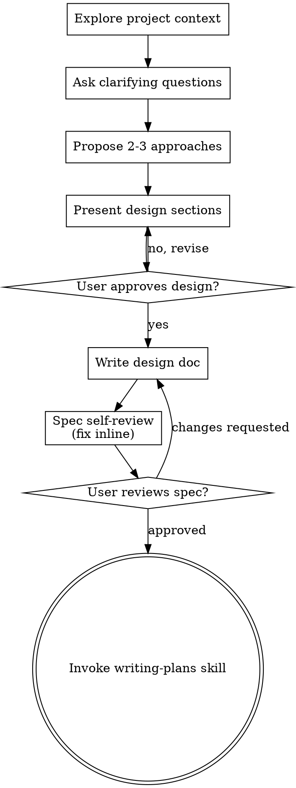

# 아이디어를 디자인으로 브레인스토밍하기 (Brainstorming Ideas Into Designs)

자연스러운 협업 대화를 통해 아이디어를 완벽하게 형성된 디자인 및 규격(spec)으로 발전시키도록 돕습니다.

현재 프로젝트 컨텍스트를 이해하는 것부터 시작한 다음, 질문을 하나씩 던져 아이디어를 구체화하세요. 구축하려는 내용을 이해하고 나면 디자인을 제시하고 사용자의 승인을 받으세요.

<HARD-GATE>
디자인을 제시하고 사용자가 이를 승인할 때까지 어떠한 구현 스킬도 호출하지 말고, 코드를 작성하거나, 프로젝트 스캐폴딩을 수행하거나, 구현 조치를 취하지 마세요. 이는 인지된 단순성에 상관없이 모든 프로젝트에 적용됩니다.
</HARD-GATE>

## 안티 패턴: "너무 간단해서 디자인이 필요 없다" (Anti-Pattern: "This Is Too Simple To Need A Design")

모든 프로젝트는 이 프로세스를 거칩니다. 할 일 목록, 단일 기능 유틸리티, 설정 변경 등 모두 해당됩니다. "단순한" 프로젝트일수록 검증되지 않은 가정으로 인해 가장 많은 작업 낭비가 발생합니다. 디자인은 짧을 수 있지만 (진짜 단순한 프로젝트의 경우 몇 문장), 반드시 이를 제시하고 승인을 받아야 합니다.

## 체크리스트 (Checklist)

다음 항목 각각에 대해 태스크를 생성하고 순서대로 완료해야 합니다:

1. **프로젝트 컨텍스트 탐색** — 파일, 문서, 최근 커밋 확인
2. **필요 시점에 시각적 동반자(visual companion) 제안** — 사전에 제안하지 마세요. 질문을 설명하는 것보다 보여주는 것이 진정으로 더 명확할 때 (단독 메시지로) 제안합니다; 승인 시 브라우저 탭이 자동으로 열립니다. 시각적 질문이 발생하지 않으면 절대로 제안하지 마세요. 아래 '시각적 동반자' 섹션을 참조하세요.
3. **명확화 질문 작성** — 한 번에 하나씩, 목적/제약조건/성공 기준 파악
4. **2~3가지 접근 방식 제안** — 트레이드오프 및 권장 사항 포함
5. **디자인 제시** — 복잡성에 맞게 섹션을 나누어 제시하고, 각 섹션마다 사용자 승인을 받음
6. **디자인 문서 작성** — `docs/superpowers/specs/YYYY-MM-DD-<topic>-design.md`에 저장하고 커밋
7. **명세서 자체 검토 (Spec self-review)** — 플레이스홀더, 모순, 모호함, 범위에 대한 인라인 자가 점검 (아래 참조)
8. **작성된 명세서에 대한 사용자 검토** — 진행하기 전에 사용자에게 명세서 파일 검토 요청
9. **구현으로 전환** — 구현 계획 생성을 위해 writing-plans 스킬 호출

## 프로세스 흐름 (Process Flow)

**최종 터미널 상태는 writing-plans를 호출하는 것입니다.** frontend-design, mcp-builder 또는 기타 구현 스킬을 호출하지 마세요. 브레인스토밍 후 호출하는 유일한 스킬은 writing-plans입니다.

## 프로세스 (The Process)

**아이디어 이해하기:**

- 먼저 현재 프로젝트 상태(파일, 문서, 최근 커밋)를 확인하세요.
- 세부 질문을 하기 전에 범위를 평가하세요: 요청이 여러 독립적인 하위 시스템(예: "채팅, 파일 저장소, 결제 및 분석이 포함된 플랫폼 구축")을 설명하는 경우 이를 즉시 표시하세요. 먼저 분해해야 하는 프로젝트의 세부사항을 다듬느라 질문을 낭비하지 마세요.
- 프로젝트가 단일 명세서로 다루기에 너무 크다면 사용자가 하위 프로젝트로 분해할 수 있도록 도우세요: 독립적인 부분은 무엇인지, 서로 어떻게 연관되는지, 어떤 순서로 구축해야 하는지? 그 후 첫 번째 하위 프로젝트를 일반 디자인 흐름에 따라 브레인스토밍하세요. 각 하위 프로젝트는 자체 명세서 → 계획 → 구현 사이클을 가집니다.
- 적절한 범위의 프로젝트의 경우, 질문을 하나씩 던져 아이디어를 구체화하세요.
- 가능하면 객관식 질문을 선호하되, 주관식도 괜찮습니다.
- 메시지당 하나의 질문만 하세요 - 한 주제에 대해 추가 탐색이 필요하다면 여러 질문으로 나누세요.
- 목적, 제약 조건, 성공 기준을 파악하는 데 집중하세요.

**접근 방식 탐색하기:**

- 트레이드오프가 포함된 2~3가지 다른 접근 방식을 제안하세요.
- 추천하는 옵션과 이유를 제시하면서 대화체로 옵션을 제시하세요.
- 추천 옵션을 먼저 제시하고 그 이유를 설명하세요.

**디자인 제시하기:**

- 구축하려는 내용을 이해했다고 판단되면 디자인을 제시하세요.
- 각 섹션의 복잡성에 맞게 분량을 조절하세요: 간단하다면 몇 문장, 미묘한 부분이 있다면 최대 200-300 단어.
- 각 섹션 제시 후 지금까지의 내용이 맞는지 확인 질문을 하세요.
- 아키텍처, 컴포넌트, 데이터 흐름, 에러 처리, 테스트 항목을 다루세요.
- 이해가 안 되는 부분이 있다면 돌아가서 명확히 할 준비를 하세요.

**격리 및 명확성을 위한 디자인:**

- 시스템을 각각 하나의 명확한 목적을 갖고, 잘 정의된 인터페이스를 통해 통신하며, 독립적으로 이해하고 테스트할 수 있는 더 작은 단위로 분할하세요.
- 각 단위에 대해 다음 질문에 답할 수 있어야 합니다: 무엇을 하는가, 어떻게 사용하는가, 무엇에 의존하는가?
- 내부 구현을 읽지 않고도 해당 단위가 무엇을 하는지 이해할 수 있나요? 소비자를 깨뜨리지 않고 내부 구현을 변경할 수 있나요? 그렇지 않다면 경계 설정 작업이 더 필요합니다.
- 잘 구획된 더 작은 단위는 작업하기에도 더 용이합니다 - 한 번에 컨텍스트에 담을 수 있는 코드에 대해 더 잘 추론할 수 있고, 파일이 집중되어 있을 때 수정 작업이 더 안정적입니다. 파일이 커지면 이는 너무 많은 일을 하고 있다는 신호인 경우가 많습니다.

**기존 코드베이스에서 작업하기:**

- 변경 사항을 제안하기 전에 현재 구조를 탐색하세요. 기존 패턴을 따르세요.
- 기존 코드에 작업에 영향을 주는 문제(예: 너무 커진 파일, 모호한 경계, 얽힌 책임)가 있는 경우, 좋은 개발자가 작업 중인 코드를 개선하는 방식으로 디자인의 일부로 타겟팅된 개선 사항을 포함하세요.
- 무관한 리팩토링은 제안하지 마세요. 현재 목표에 도움이 되는 것에만 집중하세요.

## 디자인 완료 후 (After the Design)

**문서화:**

- 검증된 디자인(명세서)을 `docs/superpowers/specs/YYYY-MM-DD-<topic>-design.md`에 작성하세요.
  - (명세서 위치에 대한 사용자 선호도가 있는 경우 이 기본값이 오버라이드됨)
- 이용 가능한 경우 elements-of-style:writing-clearly-and-concisely 스킬을 사용하세요.
- 디자인 문서를 git에 커밋하세요.

**명세서 자체 검토 (Spec Self-Review):**
명세서 문서를 작성한 후 새 시각으로 검토하세요:

1. **플레이스홀더 스캔:** "TBD", "TODO", 미완성 섹션 또는 모호한 요구사항이 있나요? 수정하세요.
2. **내부 일관성:** 섹션끼리 서로 모순되는 부분이 있나요? 아키텍처가 기능 설명과 일치하나요?
3. **범위 점검:** 단일 구현 계획에 집중되어 있나요, 아니면 분해가 필요한가요?
4. **모호성 점검:** 요구사항이 두 가지 다른 방식으로 해석될 수 있나요? 그렇다면 하나를 선택하여 명시적으로 만드세요.

문제가 있다면 인라인으로 즉시 수정하세요. 재검토할 필요 없이 수정 후 다음으로 넘어가면 됩니다.

**사용자 검토 게이트 (User Review Gate):**
명세서 검토 루프가 통과되면 진행하기 전에 작성된 명세서를 검토하도록 사용자에게 요청하세요:

> "Spec written and committed to `<path>`. Please review it and let me know if you want to make any changes before we start writing out the implementation plan."

사용자의 응답을 기다리세요. 변경을 요청하면 수정 후 명세서 검토 루프를 다시 실행하세요. 사용자가 승인한 후에만 진행하세요.

**구현 (Implementation):**

- 상세 구현 계획을 작성하기 위해 writing-plans 스킬을 호출하세요.
- 다른 어떠한 스킬도 호출하지 마세요. writing-plans가 다음 단계입니다.

## 핵심 원칙 (Key Principles)

- **한 번에 한 질문씩** - 여러 질문으로 과도한 부담을 주지 마세요.
- **객관식 선호** - 가능하면 주관식보다 답변하기 쉽습니다.
- **철저한 YAGNI** - 모든 디자인에서 불필요한 기능을 제거하세요.
- **대안 탐색** - 최종 결정 전 항상 2~3가지 접근 방식을 제안하세요.
- **단계적 검증** - 디자인을 제시하고 다음으로 넘어가기 전에 승인을 받으세요.
- **유연성 유지** - 무언가 이해가 되지 않을 때는 돌아가서 명확히 하세요.

## 시각적 동반자 (Visual Companion)

브레인스토밍 중에 목업, 다이어그램 및 시각적 옵션을 보여주기 위한 브라우저 기반 동반자입니다. 모드가 아닌 툴로 제공됩니다. 동반자를 수락한다는 것은 시각적 처리가 유용한 질문에 이용할 수 있다는 의미이지, 모든 질문이 브라우저를 거쳐야 한다는 의미는 아닙니다.

**동반자 제안 (필요 시점에):** 사전에 제안하지 마세요. 단순히 UI *주제*가 아니라 실제 목업/레이아웃/다이어그램 질문과 같이 말을 하는 것보다 보여주는 것이 진정으로 더 명확해질 때까지 기다리세요. 처음 발생하는 시점에 단독 메시지로 제안하세요:
> "This next part might be easier if I show you — I can put together mockups, diagrams, and comparisons in a browser tab as we go. It's still new and can be token-intensive. Want me to? I'll open it for you."

**이 제안은 반드시 독립된 메시지여야 합니다.** 명확화 질문, 요약 또는 기타 콘텐츠 없이 제안만 포함해야 합니다. 사용자의 응답을 기다리세요. 수락하는 경우 `--open` 옵션으로 서버를 시작하여 사용자의 브라우저가 첫 화면으로 자동 열리도록 하세요. 거절하는 경우 텍스트 전용으로 계속 진행하고 사용자가 먼저 꺼내지 않는 한 다시 제안하지 마세요.

**질문별 결정:** 사용자가 수락하더라도 각 질문마다 브라우저를 사용할지 터미널을 사용할지 결정하세요. 테스트 기준: **사용자가 글을 읽는 것보다 눈으로 보는 것이 더 잘 이해될까?**

- 목업, 와이어프레임, 레이아웃 비교, 아키텍처 다이어그램, 시각적 디자인과 같이 시각적인 콘텐츠에는 **브라우저를 사용**하세요.
- 요구사항 질문, 개념적 선택, 트레이드오프 목록, A/B/C/D 텍스트 옵션, 범위 결정과 같은 텍스트 콘텐츠에는 **터미널을 사용**하세요.

UI 주제에 관한 질문이라고 해서 자동으로 시각적 질문이 되는 것은 아닙니다. "이 컨텍스트에서 개인화는 무엇을 의미하나요?"는 개념적 질문이므로 터미널을 사용하세요. "어떤 위저드 레이아웃이 더 효과적인가요?"는 시각적 질문이므로 브라우저를 사용하세요.

동반자에 동의하면 진행하기 전에 상세 가이드를 읽으세요:
`skills/brainstorming/visual-companion.md`
