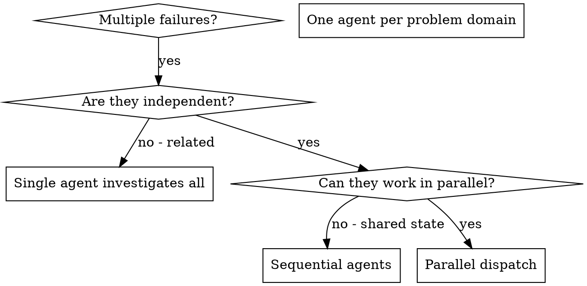

# 병렬 에이전트 디스패치 (Dispatching Parallel Agents)

## 개요

당신은 격리된 컨텍스트를 가진 전문화된 에이전트들에게 작업을 위임합니다. 그들의 지시사항과 컨텍스트를 정밀하게 작성함으로써, 에이전트가 집중력을 유지하고 작업에 성공하도록 보장합니다. 에이전트는 당신 세션의 컨텍스트나 기록을 결코 상속받아서는 안 됩니다 — 그들이 필요한 것을 당신이 정확하게 구성해 주어야 합니다. 이는 조율 작업을 위한 당신 자신의 컨텍스트 공간을 보존해 주기도 합니다.

서로 연관이 없는 여러 실패(서로 다른 테스트 파일, 서로 다른 서브시스템, 서로 다른 버그)가 존재할 때, 이를 순차적으로 조사하는 것은 시간을 낭비합니다. 각 조사는 독립적이며 병렬로 진행될 수 있습니다.

**핵심 원칙:** 독립된 문제 도메인당 하나의 에이전트를 디스패치하세요. 에이전트들이 동시(concurrently)에 작업하도록 하세요.

## 언제 사용해야 하는가



**사용해야 하는 경우:**
- 3개 이상의 테스트 파일이 서로 다른 근본 원인으로 실패하고 있을 때
- 여러 서브시스템이 독립적으로 고장 났을 때
- 각 문제를 다른 문제의 컨텍스트 없이도 이해할 수 있을 때
- 조사 과정 사이에 공유 상태(shared state)가 없을 때

**사용하지 말아야 하는 경우:**
- 실패들이 서로 연관되어 있을 때 (하나를 고치면 다른 것도 고쳐질 수 있는 경우)
- 전체 시스템 상태를 이해해야 할 때
- 에이전트들이 서로 간섭할 위험이 있을 때

## 패턴 (The Pattern)

### 1. 독립된 도메인 식별

고장 난 원인별로 실패 항목을 그룹화합니다:
- 파일 A 테스트: 도구 승인 흐름 (Tool approval flow)
- 파일 B 테스트: 배치 완료 동작 (Batch completion behavior)
- 파일 C 테스트: 중단 기능 (Abort functionality)

각 도메인은 독립적입니다 - 도구 승인을 수정해도 중단 테스트에는 영향이 없습니다.

### 2. 집중된 에이전트 작업 작성

각 에이전트에 제공할 항목:
- **구체적 범위(Scope):** 단 하나의 테스트 파일 또는 서브시스템
- **명확한 목표(Goal):** 해당 테스트들을 통과시키기
- **제약 사항(Constraints):** 다른 코드를 변경하지 말 것
- **예상 출력(Expected output):** 발견하고 수정한 내용에 대한 요약

### 3. 병렬로 디스패치 (Dispatch in Parallel)

단일 응답 내에서 3개의 서브에이전트 디스패치를 모두 발행하세요 — 에이전트들이 병렬로 실행됩니다:

```text
Subagent (general-purpose): "Fix agent-tool-abort.test.ts failures"
Subagent (general-purpose): "Fix batch-completion-behavior.test.ts failures"
Subagent (general-purpose): "Fix tool-approval-race-conditions.test.ts failures"
# 세 에이전트 모두 동시에 실행됩니다.
```

한 번의 응답에 여러 디스패치 호출을 포함 = 병렬 실행. 응답당 하나씩 호출 = 순차 실행.

### 4. 검토 및 통합 (Review and Integrate)

에이전트들이 결과를 반환했을 때:
- 각 요약 내용을 읽기
- 수정 사항들이 충돌하지 않는지 검증하기
- 전체 테스트 수트 실행하기
- 모든 변경 사항 통합하기

## 에이전트 프롬프트 구조

좋은 에이전트 프롬프트의 요건:
1. **집중됨 (Focused)** - 단 하나의 명확한 문제 도메인
2. **자급자족형 (Self-contained)** - 문제를 이해하는 데 필요한 모든 컨텍스트 제공
3. **출력 결과의 구체성** - 에이전트가 무엇을 반환해야 하는지 명시

```markdown
Fix the 3 failing tests in src/agents/agent-tool-abort.test.ts:

1. "should abort tool with partial output capture" - expects 'interrupted at' in message
2. "should handle mixed completed and aborted tools" - fast tool aborted instead of completed
3. "should properly track pendingToolCount" - expects 3 results but gets 0

These are timing/race condition issues. Your task:

1. Read the test file and understand what each test verifies
2. Identify root cause - timing issues or actual bugs?
3. Fix by:
   - Replacing arbitrary timeouts with event-based waiting
   - Fixing bugs in abort implementation if found
   - Adjusting test expectations if testing changed behavior

Do NOT just increase timeouts - find the real issue.

Return: Summary of what you found and what you fixed.
```

## 흔한 실수 (Common Mistakes)

**❌ 너무 광범위함:** "Fix all the tests" - 에이전트가 길을 잃음
**✅ 구체적임:** "Fix agent-tool-abort.test.ts" - 집중된 범위

**❌ 컨텍스트 없음:** "Fix the race condition" - 에이전트가 위치를 알 수 없음
**✅ 컨텍스트 제공:** 에러 메시지와 테스트 이름을 붙여넣음

**❌ 제약 없음:** 에라이전트가 모든 코드를 리팩터링할 위험
**✅ 제약 설정:** "Do NOT change production code" 또는 "Fix tests only"

**❌ 모호한 출력:** "Fix it" - 무엇이 변경되었는지 알 수 없음
**✅ 구체적인 요구:** "Return summary of root cause and changes"

## 사용하지 말아야 하는 경우 (When NOT to Use)

**연관된 실패:** 하나를 고치면 다른 것도 고쳐질 수 있음 - 먼저 함께 조사하세요
**전체 컨텍스트가 필요함:** 전체 시스템을 확인해야 이해가 가능한 경우
**탐색적 디버깅:** 무엇이 고장 났는지 아직 모르는 상태
**공유 상태:** 에력전트들이 서로 간섭함 (동일한 파일 편집, 동일한 자원 사용)

## 실무 세션 실제 사례

**시나리오:** 대규모 리팩터링 후 3개 파일에 걸쳐 6개의 테스트 실패 발생

**실패 내역:**
- agent-tool-abort.test.ts: 3개 실패 (타이밍 문제)
- batch-completion-behavior.test.ts: 2개 실패 (도구가 실행되지 않음)
- tool-approval-race-conditions.test.ts: 1개 실패 (실행 횟수 = 0)

**결정:** 독립된 도메인임 - 중단 로직, 배치 완료, 레이스 조건이 각각 별개임

**디스패치:**
```
Agent 1 → Fix agent-tool-abort.test.ts
Agent 2 → Fix batch-completion-behavior.test.ts
Agent 3 → Fix tool-approval-race-conditions.test.ts
```

**결과:**
- Agent 1: 타임아웃을 이벤트 기반 대기로 대체함
- Agent 2: 이벤트 구조 버그를 수정함 (threadId 위치 오류)
- Agent 3: 비동기 도구 실행 완료 대기를 추가함

**통합:** 모든 수정 사항이 독립적이고 충돌이 없었으며 전체 테스트 수트 통과함

**절약된 시간:** 3개의 문제를 순차적이 아닌 병렬로 동시에 해결함

## 핵심 장점

1. **병렬화 (Parallelization)** - 여러 조사가 동시에 일어남
2. **집중 (Focus)** - 각 에이전트의 범위가 좁아 추적할 컨텍스트가 적음
3. **독립성 (Independence)** - 에이전트들이 서로 간섭하지 않음
4. **속도 (Speed)** - 1개를 해결할 시간에 3개의 문제를 해결함

## 검증 (Verification)

에이전트가 결과를 반환한 후:
1. **각 요약 검토** - 무엇이 변경되었는지 이해
2. **충돌 검사** - 에이전트들이 동일한 코드를 편집했는지 확인
3. **전체 수트 실행** - 모든 수정 사항이 함께 잘 동작하는지 검증
4. **스팟 체크 (Spot check)** - 에이전트가 체계적 오류를 범하지 않았는지 점검

## 실무 적용 효과

디버깅 세션 결과 (2025-10-03):
- 3개 파일에 걸친 6개의 실패
- 3개의 에이전트를 병렬 디스패치
- 모든 조사가 동시 완료됨
- 모든 수정 사항 성공적으로 통합됨
- 에이전트 변경 사항 간 충돌 제로
