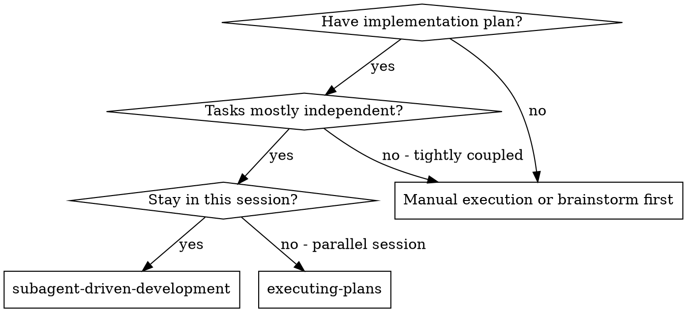
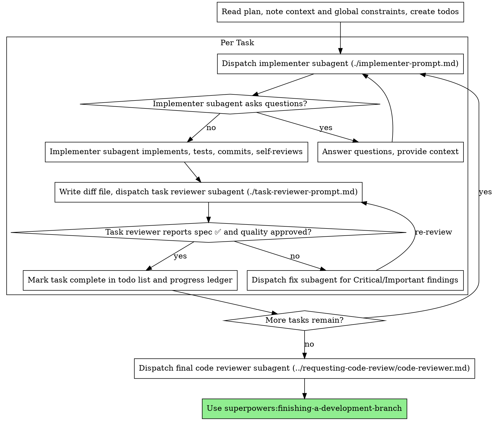

# 서브에이전트 기반 개발 (Subagent-Driven Development)

태스크당 새로운 구현자 서브에이전트를 파견하고, 각 태스크 완료 후 태스크 검토(명세서 준수 + 코드 품질)를 수행하며, 마지막에 브랜치 전체 검토를 수행하여 계획을 실행합니다.

**서브에이전트를 사용하는 이유:** 격리된 컨텍스트를 가진 전문 에이전트에게 태스크를 위임합니다. 지침과 컨텍스트를 정교하게 구성함으로써 서브에이전트가 집중력을 유지하고 태스크를 성공적으로 완수하도록 돕습니다. 서브에이전트는 사용자의 세션 컨텍스트나 히스토리를 절대로 상속받지 않으며 — 오직 서브에이전트에게 필요한 내용만 명확하게 구성하여 제공합니다. 이는 조율 작업을 위한 자신의 자체 컨텍스트도 보존합니다.

**핵심 원칙:** 태스크당 새로운 서브에이전트 + 태스크 검토 (명세서 + 품질) + 종합 최종 검토 = 높은 품질, 빠른 반복

**내레이션:** 툴 호출 사이에는 최대 한 줄의 짧은 내레이션만 작성하세요 — 대장(ledger)과 툴 결과가 기록을 담고 있습니다.

**지속적 실행:** 태스크 사이에 인간 파트너에게 확인하기 위해 대기를 정지하지 마세요. 중단 없이 계획의 모든 태스크를 실행하세요. 정지해야 하는 유일한 이유는 해결할 수 없는 BLOCKED 상태, 진행을 진정으로 방지하는 모호함, 또는 모든 태스크 완료입니다. "계속할까요?"와 같은 확인 프롬프트나 진행 상황 요약은 사용자의 시간을 낭비합니다 — 계획을 실행해달라고 요청받았으니, 그대로 실행하세요.

## 사용 시점 (When to Use)



**계획 실행(executing-plans - 병렬 세션)과의 비교:**
- 동일 세션 유지 (컨텍스트 스위칭 없음)
- 태스크당 새로운 서브에이전트 (컨텍스트 오염 없음)
- 각 태스크 후 검토 (명세서 준수 + 코드 품질), 마지막에 종합 검토
- 더 빠른 반복 (태스크 사이에 사람의 개입 없음)

## 프로세스 (The Process)



## 사전 계획 검토 (Pre-Flight Plan Review)

Task 1을 파견하기 전에 충돌 사항이 없는지 계획을 전체적으로 1회 스캔하세요:

- 서로 모순되거나 계획의 전역 제약 조건(Global Constraints)과 충돌하는 태스크
- 계획에서 명시적으로 규정하지만 검토 루브릭에서 결함으로 다루는 모든 것 (아무것도 단언하지 않는 테스트, 로직 블록의 축어적 중복)

발견된 모든 항목을 실행을 시작하기 전에 하나의 묶음 질문 형태로 인간 파트너에게 제시하세요 — 각각의 발견 사항을 해당 규정을 명시한 계획 텍스트와 함께 표시하고 어느 쪽을 적용할지 확인하세요 — 계획 중간에 발견할 때마다 인터럽트를 걸지 마세요. 스캔이 깨끗하다면 별도의 코멘트 없이 진행하세요. 검토 루프는 구현 과정에서만 나타나는 충돌을 걸러내는 그물 역할을 유지합니다.

## 모델 선택 (Model Selection)

비용을 절감하고 속도를 높이기 위해 각 역할에 적합한 가장 작은 수준의 모델을 사용하세요.

**기계적인 구현 태스크** (격리된 함수, 명확한 명세서, 1-2개 파일): 빠르고 저렴한 모델을 사용하세요. 계획이 잘 지정되어 있다면 대부분의 구현 태스크는 기계적입니다.

**통합 및 판단 태스크** (다중 파일 조율, 패턴 매칭, 디버깅): 표준 모델을 사용하세요.

**아키텍처 및 디자인 태스크**: 이용 가능한 가장 성능이 뛰어난 모델을 사용하세요. 최종 브랜치 전체 검토가 이에 해당합니다 — 세션 기본값이 아닌 이용 가능한 가장 강력한 모델로 파견하세요.

**검토 태스크**: diff의 크기, 복잡성 및 위험성에 맞춰 동일한 판단력으로 모델을 선택하세요. 작고 기계적인 diff는 가장 강력한 모델이 필요하지 않지만, 미묘한 동시성 변경에는 필요합니다.

**서브에이전트를 파견할 때 항상 모델을 명시적으로 지정하세요.** 모델을 생략하면 세션의 모델(보통 가장 강력하고 가장 비싼 모델)을 상속하게 되어 이 섹션의 목적을 조용히 무력화합니다.

**턴(turn) 횟수가 토큰 가격보다 중요합니다.** 작업 시간과 컨텍스트 비용은 서브에이전트가 얼마나 많은 턴을 수행하는지에 따라 결정되며, 가장 저렴한 모델은 다단계 작업에서 정기적으로 2~3배의 턴을 소모하여 — 전체적으로 더 많은 비용이 발생합니다. 검토자 및 글로 된 설명에 의존하는 구현자의 기본 하한선으로 중간 단계 모델을 사용하세요. 태스크의 계획 텍스트에 작성할 전체 코드가 포함되어 있을 때는 구현이 받아 적기 및 테스트에 불과하므로 해당 구현자에는 가장 저렴한 등급을 사용하세요. 단일 파일의 기계적 수정 작업도 가장 저렴한 등급을 사용합니다.

**태스크 복잡성 신호 (구현 태스크):**
- 완전한 명세서와 함께 1-2개 파일 수정 → 저렴한 모델
- 통합 고려사항과 함께 여러 파일 수정 → 표준 모델
- 디자인 판단 또는 광범위한 코드베이스 이해 필요 → 가장 강력한 모델

## 구현자 상태 처리 (Handling Implementer Status)

구현자 서브에이전트는 4가지 상태 중 하나를 보고합니다. 각 상태를 적절히 처리하세요:

**DONE:** 검토 패키지(`scripts/review-package BASE HEAD` — 이 스킬 디렉토리에 존재함; 생성된 독자적인 파일 경로가 출력됨; BASE는 구현자를 파견하기 전에 기록한 커밋이어야 함 — 절대로 `HEAD~1`을 쓰지 마세요. 다중 커밋 태스크의 마지막 커밋을 제외한 나머지가 누락됩니다)를 생성한 다음, 출력된 경로로 태스크 검토자를 파견하세요.

**DONE_WITH_CONCERNS:** 구현자가 작업을 완료했으나 의문 사항을 표시했습니다. 진행하기 전에 우려 사항을 읽어보세요. 우려 사항이 정확성이나 범위에 관한 것이라면 검토 전에 이를 해결하세요. 관찰 사항(예: "이 파일이 커지고 있습니다")이라면 기록해 두고 검토를 진행하세요.

**NEEDS_CONTEXT:** 구현자에게 제공되지 않은 정보가 필요합니다. 누락된 컨텍스트를 제공하고 재파견하세요.

**BLOCKED:** 구현자가 태스크를 완료할 수 없습니다. 차단 요인을 평가하세요:
1. 컨텍스트 문제라면 더 많은 컨텍스트를 제공하고 동일한 모델로 재파견
2. 태스크에 더 많은 추론이 필요하다면 더 강력한 모델로 재파견
3. 태스크가 너무 크다면 더 작은 단위로 분할
4. 계획 자체가 틀렸다면 사용자에게 보고

에스컬레이션을 무시하거나 변경 사항 없이 동일한 모델로 재시도를 강제하지 **마세요**. 구현자가 막혔다고 했다면 무언가가 변경되어야 합니다.

## 검토자의 ⚠️ 항목 처리 (Handling Reviewer ⚠️ Items)

태스크 검토자가 "⚠️ diff만으로는 검증할 수 없음" 항목(수정되지 않은 코드에 존재하거나 여러 태스크에 걸쳐 있는 요구사항)을 보고할 수 있습니다. 이 항목들이 나머지 검토 과정을 막지는 않지만, 태스크를 완료로 표시하기 전에 직접 각 항목을 해결해야 합니다: 당신이 계획 및 태스크 간 컨텍스트를 가지고 있습니다. 해당 항목이 실제 누락 사항임을 확인했다면 명세서 검토 실패로 취급하세요 — 구현자에게 돌려보내 수정 후 재검토를 거치세요.

## 검토자 프롬프트 구성하기 (Constructing Reviewer Prompts)

태스크별 검토는 태스크 단위 게이트입니다. 광범위한 검토는 최종 브랜치 전체 검토 시 1회 수행됩니다. 검토자 템플릿을 채울 때:

- 구체적이고 태스크에 특화된 이유 없이 "모든 사용처 점검" 또는 "유용하다면 레이스 테스트 실행"과 같은 개방형 지시를 추가하지 마세요.
- 동일한 코드에 대해 구현자가 이미 실행한 테스트를 검토자에게 다시 실행하도록 요청하지 마세요 — 구현자의 보고서가 테스트 증거를 담고 있습니다.
- 검토자의 발견 사항을 사전에 지레짐작하지 마세요 — 검토자에게 특정 이슈를 무시하거나 표시하지 말라고 지시하지 마세요. 특정 발견 사항이 오탐일 것으로 생각되더라도 검토자가 이를 제기하도록 두고 검토 루프에서 판단하세요. 작성 중인 프롬프트에 "do not flag", "don't treat X as a defect", "at most Minor", 또는 "the plan chose"가 포함되어 있다면 — 멈추세요: 당신은 보통 검토 루프를 아끼기 위해 사전에 짐작하고 있는 것입니다.
- 검토자에게 전달하는 전역 제약 조건(global-constraints) 블록은 검토자의 주의를 집중시키는 렌즈입니다. 계획의 Global Constraints 섹션이나 명세서의 구속력 있는 요구사항을 그대로 복사하세요: 정확한 값, 정확한 포맷, 및 컴포넌트 간 명시된 관계 ("same layout as X", "matches Y"). 검토자의 템플릿에는 이미 프로세스 규칙(YAGNI, 테스트 위생, 검토 방법)이 포함되어 있습니다 — 제약 조건 블록은 "이" 프로젝트의 명세서가 요구하는 사항을 위한 것입니다.
- 검토자에게 diff를 파일 형태로 전달하세요: 이 스킬의 `scripts/review-package BASE HEAD`를 실행하고 출력된 파일 경로를 검토자에게 전달하세요 (또는 bash 없이: 해당 범위의 `git log --oneline`, `git diff --stat`, `git diff -U10`을 하나의 고유한 파일로 리다이렉트). 그 출력 결과는 여러분 자신의 컨텍스트에 절대로 들어가지 않으며, 검토자는 한 번의 Read 호출로 커밋 목록, stat 요약, 전체 diff를 컨텍스트와 함께 확인합니다. 구현자를 파견하기 전에 기록한 BASE를 사용하세요 — 다중 커밋 태스크를 누락시키는 `HEAD~1`을 절대 사용하지 마세요.
- 파견 프롬프트는 세션 히스토리가 아닌 하나의 태스크를 설명합니다. 이전 태스크의 누적 요약("state after Tasks 1-3")을 이후 파견에 붙여넣지 마세요 — 실제 세션의 파견 프롬프트가 42,000자에 달했고 그중 99%가 붙여넣은 히스토리였습니다. 새로운 서브에이전트에게 필요한 것은 자신이 다루는 태스크, 수정하는 인터페이스, 그리고 전역 제약 조건입니다. 그 외에는 필요 없습니다.
- Critical 및 Important 발견 사항에 대해 수정 서브에이전트를 파견하세요. 진행하는 동안 Minor 발견 사항을 진행 대장(progress ledger)에 기록하고, 머지 전에 수정해야 할 사항을 분류할 수 있도록 최종 브랜치 전체 검토 시 해당 목록을 지목하세요. 아무도 읽지 않는 요약은 조용한 폐기입니다.
- 계획에서 규정한 것으로 표기된 발견 사항 — 또는 계획의 텍스트가 요구하는 바와 충돌하는 모든 발견 사항 — 은 여느 계획 충돌과 마찬가지로 사람의 결정 사항입니다: 발견 사항과 계획 텍스트를 제시하고 어느 쪽을 적용할지 질문하세요. 계획이 규정했다고 해서 발견 사항을 묵살하지 마시고, 물어보지 않고 계획에 반하는 수정을 파견하지 마세요.
- 최종 브랜치 전체 검토 역시 패키지를 전달받습니다: `scripts/review-package MERGE_BASE HEAD` (MERGE_BASE = 브랜치가 시작된 커밋, 예: `git merge-base main HEAD`)를 실행하고 출력된 경로를 최종 검토 파견에 포함시켜 최종 검토자가 git 명령어로 브랜치 diff를 재도출하는 대신 하나의 파일을 읽게 하세요.
- 모든 수정 파견은 구현자 계약을 이행합니다: 수정 서브에이전트는 변경 사항을 다루는 테스트를 다시 실행하고 결과를 보고합니다. 파견 시 해당 테스트 파일을 지정하세요 — 한 줄 수정에 전체 수트가 필요하지 않습니다. 검토자를 재파견하기 전에 수정 보고서에 관련 테스트, 실행된 명령어 및 출력이 포함되어 있는지 확인하세요; 세 가지가 모두 확인되면 재검토를 파견하세요.
- 최종 브랜치 전체 검토에서 발견 사항이 반환되면, 발견 사항당 하나의 수정 에이전트가 아닌 전체 발견 사항 목록을 가진 단 하나의 수정 서브에이전트를 파견하세요. 발견 사항당 수정자는 매번 컨텍스트를 다시 구축하고 수트를 재실행합니다; 실제 세션의 최종 검토 수정 파도가 모든 태스크를 합친 것보다 더 많은 비용이 들었습니다.

## 파일 핸드오프 (File Handoffs)

파견 프롬프트에 붙여넣는 모든 내용 — 그리고 서브에이전트가 출력하는 모든 내용 — 은 세션의 나머지 기간 동안 사용자의 컨텍스트에 남아 매 턴마다 다시 읽히게 됩니다. 산출물은 파일 형태로 전달하세요:

- **태스크 지침서 (Task brief):** 구현자를 파견하기 전에 이 스킬의 `scripts/task-brief PLAN_FILE N`을 실행하세요 — 이는 태스크의 전체 텍스트를 독자적인 파일로 추출하고 경로를 출력합니다. 지침서가 요구사항의 단일 출처로 유지되도록 파견 프롬프트를 구성하세요. 파견 프롬프트에는 다음이 포함되어야 합니다: (1) 프로젝트에서 이 태스크의 위치에 대한 한 줄 설명; (2) 지침서 경로 ("read this first — it is your requirements, with the exact values to use verbatim"으로 소개); (3) 이전 태스크에서 발생하여 지침서가 알 수 없는 인터페이스 및 결정 사항; (4) 지침서에서 발견한 모호함에 대한 당신의 해결책; (5) 보고서 파일 경로 및 보고서 계약. 정확한 값들(숫자, 매직 스트링, 시그니처, 테스트 케이스)은 오직 지침서에만 등장합니다.
- **보고서 파일 (Report file):** 구현자의 보고서 파일 이름을 지침서 이름에 맞춰 작성하고 (지침서 `…/task-N-brief.md` → 보고서 `…/task-N-report.md`) 파견 프롬프트에 포함하세요. 구현자는 전체 보고서를 거기에 작성하고 상태, 커밋, 한 줄 테스트 요약, 및 우려 사항만 반환합니다.
- **검토자 입력물:** 태스크 검토자는 3개의 경로(동일한 지침서 파일, 보고서 파일, 검토 패키지)와 해당 태스크를 구속하는 전역 제약 조건을 전달받습니다.
- 수정 파견은 테스트 결과가 포함된 수정 보고서를 동일한 보고서 파일에 덧붙이고 짧은 요약을 반환합니다; 재검토 시 업데이트된 파일을 읽습니다.

## 지속 가능한 진행 상황 관리 (Durable Progress)

대화 메모리는 압축(compaction) 시 살아남지 못합니다. 실제 세션에서 위치를 잃어버린 컨트롤러가 이미 완료된 전체 태스크 시퀀스를 재파견하는 사례가 관찰되었습니다 — 이는 관찰된 가장 비싼 실패 사례입니다. 진행 상황을 todo뿐만 아니라 대장(ledger) 파일에 기록하세요.

- 스킬 시작 시 대장 파일 존재 여부를 확인하세요:
  `cat "$(git rev-parse --show-toplevel)/.superpowers/sdd/progress.md"`. 거기에 완료로 표시된 태스크는 DONE 상태입니다 — 재파견하지 마세요; 완료로 표시되지 않은 첫 번째 태스크부터 재개하세요.
- 태스크 검토 결과가 문제없이 돌아오면 다른 기록 작업과 동일한 메시지에서 대장에 한 줄을 덧붙이세요:
  `Task N: complete (commits <base7>..<head7>, review clean)`.
- 대장은 복구 지도입니다: 거기에 기록된 커밋은 컨텍스트가 생성을 기억하지 못하더라도 git 내에 존재합니다. 압축 발생 후, 자신의 기억보다 대장과 `git log`를 신뢰하세요.
- `git clean -fdx`는 대장을 파괴합니다 (git-ignored scratch임); 그런 일이 발생하면 `git log`를 통해 복구하세요.

## 프롬프트 템플릿 (Prompt Templates)

- [implementer-prompt.md](implementer-prompt.md) - 구현자 서브에이전트 파견
- [task-reviewer-prompt.md](task-reviewer-prompt.md) - 태스크 검토자 서브에이전트 파견 (명세서 준수 + 코드 품질)
- 최종 브랜치 전체 검토: superpowers:requesting-code-review의 [code-reviewer.md](../requesting-code-review/code-reviewer.md) 사용

## 예시 워크플로우 (Example Workflow)

```
You: I'm using Subagent-Driven Development to execute this plan.

[Read plan file once: docs/superpowers/plans/feature-plan.md]
[Create todos for all tasks]

Task 1: Hook installation script

[Run task-brief for Task 1; dispatch implementer with brief + report paths + context]

Implementer: "Before I begin - should the hook be installed at user or system level?"

You: "User level (~/.config/superpowers/hooks/)"

Implementer: "Got it. Implementing now..."
[Later] Implementer:
  - Implemented install-hook command
  - Added tests, 5/5 passing
  - Self-review: Found I missed --force flag, added it
  - Committed

[Run review-package, dispatch task reviewer with the printed path]
Task reviewer: Spec ✅ - all requirements met, nothing extra.
  Strengths: Good test coverage, clean. Issues: None. Task quality: Approved.

[Mark Task 1 complete]

Task 2: Recovery modes

[Run task-brief for Task 2; dispatch implementer with brief + report paths + context]

Implementer: [No questions, proceeds]
Implementer:
  - Added verify/repair modes
  - 8/8 tests passing
  - Self-review: All good
  - Committed

[Run review-package, dispatch task reviewer with the printed path]
Task reviewer: Spec ❌:
  - Missing: Progress reporting (spec says "report every 100 items")
  - Extra: Added --json flag (not requested)
  - Issues (Important): Magic number (100)

[Dispatch fix subagent with all findings]
Fixer: Removed --json flag, added progress reporting, extracted PROGRESS_INTERVAL constant

[Task reviewer reviews again]
Task reviewer: Spec ✅. Task quality: Approved.

[Mark Task 2 complete]

...

[After all tasks]
[Dispatch final code-reviewer]
Final reviewer: All requirements met, ready to merge

Done!
```

## 장점 (Advantages)

**수동 실행 대비:**
- 서브에이전트가 자연스럽게 TDD를 따름
- 태스크당 새로운 컨텍스트 (혼란 없음)
- 병렬 안전성 (서브에이전트끼리 간섭하지 않음)
- 서브에이전트가 질문을 할 수 있음 (작업 전 및 작업 중)

**계획 실행(executing-plans) 대비:**
- 동일 세션 유지 (핸드오프 없음)
- 지속적인 진행 (대기 없음)
- 자동화된 검토 체크포인트

**효율성 이점:**
- 컨트롤러가 필요한 컨텍스트만 정확하게 정제함; 대용량 산출물은 붙여넣은 텍스트가 아닌 파일로 이동함
- 서브에이전트가 사전에 완전한 정보를 전달받음
- 작업 시작 전 질문이 도출됨 (작업 후가 아님)

**품질 게이트 (Quality gates):**
- 자체 검토를 통해 핸드오프 전에 문제 차단
- 태스크 검토가 명세서 준수와 코드 품질이라는 2가지 판정을 반환함
- 검토 루프를 통해 수정을 실제로 검증함
- 명세서 준수를 통해 과도하거나 부족한 구현 방지
- 코드 품질을 통해 잘 구축된 구현 보장

**비용 측면:**
- 더 많은 서브에이전트 호출 (태스크당 구현자 + 검토자)
- 컨트롤러의 더 많은 사전 준비 (사전에 모든 태스크 추출)
- 검토 루프로 인한 반복 증가
- 하지만 문제를 일찍 잡아냄 (나중에 디버깅하는 것보다 저렴함)

## 주의 사항 (Red Flags)

**절대 금지:**
- 사용자의 명시적 동의 없이 main/master 브랜치에서 구현 시작하기
- 태스크 검토를 건너뛰거나, 어느 한쪽의 판정이라도 누락된 보고서 수락하기 (명세서 준수와 태스크 품질 모두 필수임)
- 수정되지 않은 이슈가 있는 상태로 진행하기
- 여러 구현 서브에이전트를 동시 파견하기 (충돌 발생)
- 서브에이전트에게 전체 계획 파일을 읽게 만들기 (대신 태스크 지침서 — `scripts/task-brief` — 전달)
- 배경 설명 컨텍스트 생략하기 (서브에이전트는 태스크가 어디에 맞물리는지 이해해야 함)
- 서브에이전트 질문 무시하기 (진행하기 전에 답변해 줄 것)
- 명세서 준수에 대해 "이 정도면 됐다"며 타협하기 (검토자가 명세서 이슈 발견 = 미완료)
- 검토 루프 건너뛰기 (검토자가 이슈 발견 = 구현자가 수정 = 다시 검토)
- 구현자의 자체 검토로 실제 검토를 대체하기 (둘 다 필요함)
- 검토자에게 지적하지 말아야 할 내용을 지시하거나 파견 프롬프트에서 이슈 심각도를 미리 평가하기 ("treat it as Minor at most") — 계획의 예시 코드는 시작점이지 결함이 선택되었다는 증거가 아닙니다.
- diff 파일 없이 태스크 검토자 파견하기 — 먼저 생성하고 (`scripts/review-package BASE HEAD`) 프롬프트에 출력된 경로를 명시할 것
- 검토 시 해결되지 않은 Critical/Important 이슈가 남아있는 채로 다음 태스크로 이동하기
- 진행 대장에서 이미 완료로 표시한 태스크 재파견하기 — 압축이나 재개 후 대장(및 `git log`)을 확인할 것

**서브에이전트가 질문을 하는 경우:**
- 명확하고 완전하게 답변하세요
- 필요한 경우 추가 컨텍스트를 제공하세요
- 서둘러 구현에 들어가도록 독촉하지 마세요

**검토자가 문제를 발견한 경우:**
- 구현자(동일한 서브에이전트)가 이를 수정합니다
- 검토자가 다시 검토합니다
- 승인될 때까지 반복합니다
- 재검토를 건너뛰지 마세요

**서브에이전트가 태스크에 실패한 경우:**
- 구체적인 지침과 함께 수정 서브에이전트를 파견하세요
- 수동으로 직접 수정하려고 시도하지 마세요 (컨텍스트 오염 유발)

## 통합 (Integration)

**필수 워크플로우 스킬:**
- **superpowers:using-git-worktrees** - 격리된 워크스페이스 보장 (생성하거나 기존 것 검증)
- **superpowers:writing-plans** - 이 스킬이 실행할 계획 생성
- **superpowers:requesting-code-review** - 최종 브랜치 전체 검토용 코드 검토 템플릿
- **superpowers:finishing-a-development-branch** - 모든 태스크 완료 후 개발 완료 처리

**서브에이전트가 활용해야 하는 스킬:**
- **superpowers:test-driven-development** - 서브에이전트가 각 태스크에서 TDD를 수행함

**대체 워크플로우:**
- **superpowers:executing-plans** - 동일 세션 실행 대신 병렬 세션에 사용
