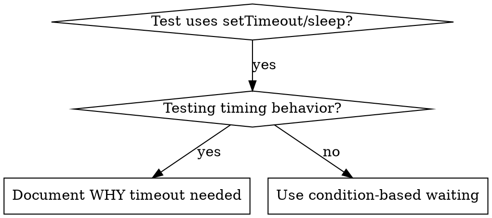

# 조건 기반 대기 (Condition-Based Waiting)

## 개요

불안정한(flaky) 테스트는 임의의 딜레이(delay)를 사용하여 타이밍을 추측하는 경우가 많습니다. 이는 빠른 머신에서는 테스트가 통과하지만 부하가 걸리거나 CI 환경에서는 실패하는 레이스 조건(race condition)을 만들어냅니다.

**핵심 원칙:** 실행에 얼마나 걸릴지 추측하지 말고, 실제로 관심 있는 조건이 충족될 때까지 대기하세요.

## 언제 사용해야 하는가



**사용해야 하는 경우:**
- 테스트에 임의의 딜레이(`setTimeout`, `sleep`, `time.sleep()`)가 포함된 경우
- 테스트가 불안정한 경우 (때때로 통과하고 부하 시 실패)
- 병렬 실행 시 테스트에서 타임아웃이 발생하는 경우
- 비동기 연산이 완료되기를 기다리는 경우

**사용하지 말아야 하는 경우:**
- 실제 타이밍 동작(디바운스, 쓰로틀 간격)을 테스트하는 경우
- 임의의 타임아웃을 사용하는 경우 반드시 그 이유(WHY)를 문서화하세요

## 핵심 패턴

```typescript
// ❌ BEFORE: 타이밍을 추측함
await new Promise(r => setTimeout(r, 50));
const result = getResult();
expect(result).toBeDefined();

// ✅ AFTER: 조건 충족을 대기함
await waitFor(() => getResult() !== undefined);
const result = getResult();
expect(result).toBeDefined();
```

## 빠른 패턴 (Quick Patterns)

| 시나리오 | 패턴 |
|----------|---------|
| 이벤트 대기 | `waitFor(() => events.find(e => e.type === 'DONE'))` |
| 상태 대기 | `waitFor(() => machine.state === 'ready')` |
| 개수 대기 | `waitFor(() => items.length >= 5)` |
| 파일 대기 | `waitFor(() => fs.existsSync(path))` |
| 복합 조건 대기 | `waitFor(() => obj.ready && obj.value > 10)` |

## 구현 예시

범용 폴링(polling) 함수:
```typescript
async function waitFor<T>(
  condition: () => T | undefined | null | false,
  description: string,
  timeoutMs = 5000
): Promise<T> {
  const startTime = Date.now();

  while (true) {
    const result = condition();
    if (result) return result;

    if (Date.now() - startTime > timeoutMs) {
      throw new Error(`Timeout waiting for ${description} after ${timeoutMs}ms`);
    }

    await new Promise(r => setTimeout(r, 10)); // 10ms마다 폴링
  }
}
```

실제 디버깅 세션에서 작성된 도메인 전용 헬퍼(`waitForEvent`, `waitForEventCount`, `waitForEventMatch`)를 포함한 전체 구현은 이 디렉터리의 `condition-based-waiting-example.ts`를 참조하세요.

## 흔한 실수 (Common Mistakes)

**❌ 너무 빠른 폴링:** `setTimeout(check, 1)` - CPU 자원 낭비
**✅ 해결책:** 10ms 마다 폴링

**❌ 타임아웃 부재:** 조건이 충족되지 않을 경우 무한 루프 발생
**✅ 해결책:** 명확한 에러 메시지와 함께 항상 타임아웃을 포함

**❌ 오래된(Stale) 데이터:** 루프 시작 전에 상태를 캐싱함
**✅ 해결책:** 항상 신선한 데이터를 얻기 위해 루프 내부에서 게터(getter) 호출

## 임의의 타임아웃이 올바른 예외 상황

```typescript
// 도구가 100ms마다 틱을 발생시킴 - 부분 출력을 검증하기 위해 틱 2회가 필요함
await waitForEvent(manager, 'TOOL_STARTED'); // 첫째: 트리거 조건 대기
await new Promise(r => setTimeout(r, 200));   // 둘째: 시간 기반 동작 대기
// 200ms = 100ms 간격 틱 2회 - 이유가 설명되고 명시됨
```

**요구 사항:**
1. 먼저 트리거 조건이 충족될 때까지 대기
2. 알려진 타이밍에 기반해야 함 (추측이 아님)
3. 이유(WHY)를 설명하는 주석 작성

## 실무 적용 효과

디버깅 세션 결과 (2025-10-03):
- 3개 파일에 걸쳐 불안정한 테스트 15개 수정
- 통과율: 60% → 100%
- 실행 시간: 40% 단축
- 레이스 조건 완전히 제거
