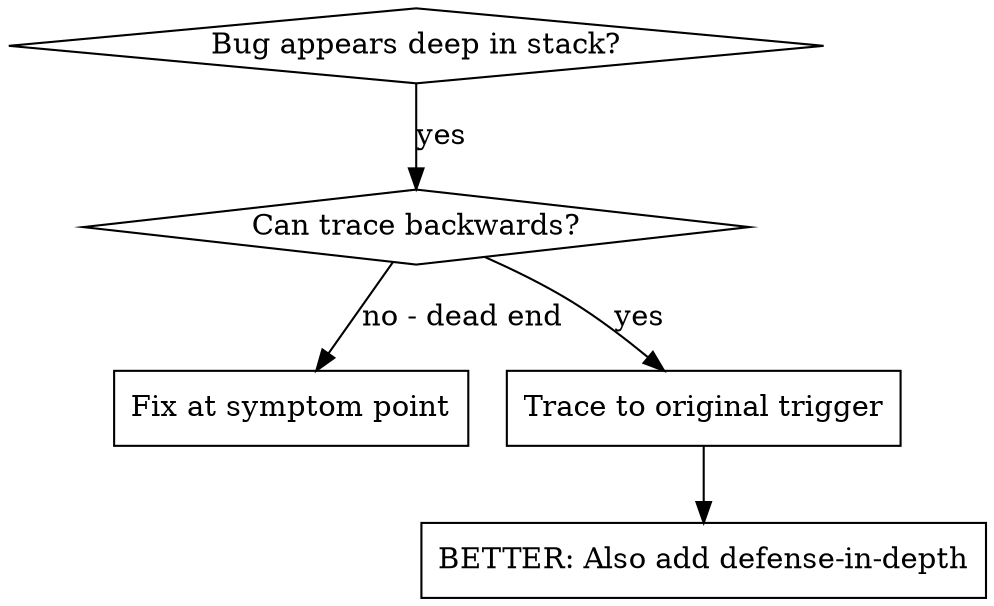
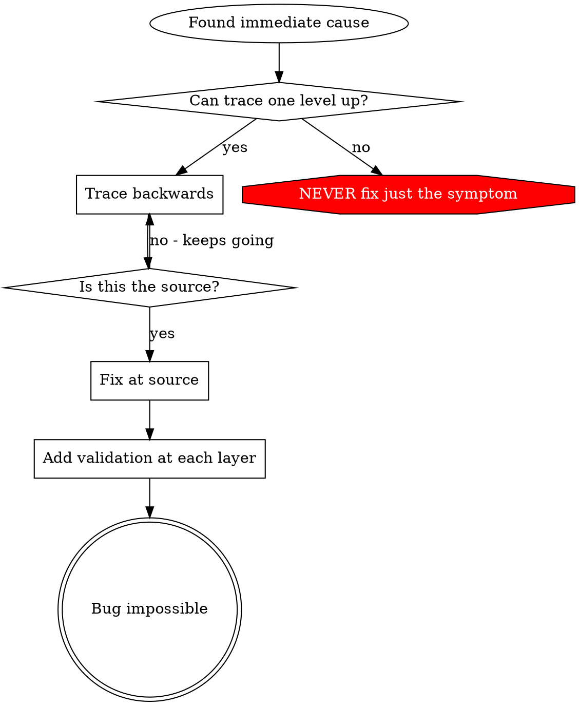

# 근본 원인 추적 (Root Cause Tracing)

## 개요

버그는 호출 스택 깊은 곳에서 표출되는 경우가 많습니다 (엉뚱한 디렉터리에서의 git init, 잘못된 위치에 생성된 파일, 잘못된 경로로 열린 데이터베이스). 직관적으로는 에러가 나타난 위치를 고치고 싶어지지만, 그것은 증상만을 다루는 것입니다.

**핵심 원칙:** 최초의 발생 계기(trigger)를 찾을 때까지 호출 체인을 따라 역방향으로 추적하고, 소스 지점에서 수정하세요.

## 언제 사용해야 하는가



**사용해야 하는 경우:**
- 에러가 진입점이 아니라 실행 깊은 곳에서 발생하는 경우
- 스택 트레이스가 긴 호출 체인을 보여주는 경우
- 유효하지 않은 데이터가 어디서 시작되었는지 불분명한 경우
- 어떤 테스트/코드가 문제를 일으키는지 찾아내야 하는 경우

## 역방향 추적 절차

### 1. 증상 관찰
```
Error: git init failed in ~/project/packages/core
```

### 2. 직접적인 원인 찾기
**어떤 코드가 이 현상을 직접적으로 유발하는가?**
```typescript
await execFileAsync('git', ['init'], { cwd: projectDir });
```

### 3. 질문하기: 이것을 호출한 것은 무엇인가?
```typescript
WorktreeManager.createSessionWorktree(projectDir, sessionId)
  → called by Session.initializeWorkspace()
  → called by Session.create()
  → called by test at Project.create()
```

### 4. 상위로 계속 추적하기
**어떤 값이 전달되었는가?**
- `projectDir = ''` (빈 문자열!)
- `cwd`에 빈 문자열이 전달되면 `process.cwd()`로 해석됨
- 그것이 바로 소스 코드 디렉터리!

### 5. 최초 발생 지점 찾기
**빈 문자열은 어디서 왔는가?**
```typescript
const context = setupCoreTest(); // { tempDir: '' } 반환
Project.create('name', context.tempDir); // beforeEach 이전에 접근함!
```

## 스택 트레이스 추가하기

수동으로 추적할 수 없는 경우, 진단 도구를 추가하세요:

```typescript
// 문제가 발생하는 연산 직전에 추가
async function gitInit(directory: string) {
  const stack = new Error().stack;
  console.error('DEBUG git init:', {
    directory,
    cwd: process.cwd(),
    nodeEnv: process.env.NODE_ENV,
    stack,
  });

  await execFileAsync('git', ['init'], { cwd: directory });
}
```

**중요:** 테스트 내에서는 로거가 아닌 `console.error()`를 사용하세요 (로거는 출력이 가려질 수 있음).

**실행 및 수집:**
```bash
npm test 2>&1 | grep 'DEBUG git init'
```

**스택 트레이스 분석:**
- 테스트 파일 이름 찾기
- 호출을 유발하는 줄 번호 찾기
- 패턴 식별 (동일한 테스트인가? 동일한 파라미터인가?)

## 문제 유발 테스트(Polluter Test) 찾기

테스트 도중 현상이 나타나지만 어떤 테스트가 원인인지 알 수 없는 경우:

이 디렉터리에 있는 분할 탐색(bisection) 스크립트 `find-polluter.sh`를 사용하세요:

```bash
./find-polluter.sh '.git' 'src/**/*.test.ts'
```

테스트를 하나씩 실행하여 첫 번째 원인 유발 테스트에서 멈춥니다. 사용법은 스크립트를 참조하세요.

## 실제 사례: 빈 projectDir

**증상:** `packages/core/` (소스 코드) 내에 `.git`이 생성됨

**추적 체인:**
1. `process.cwd()`에서 `git init` 실행 ← 빈 cwd 파라미터
2. 빈 projectDir로 WorktreeManager 호출
3. `Session.create()`에 빈 문자열 전달됨
4. 테스트가 beforeEach 이전에 `context.tempDir`에 접근함
5. `setupCoreTest()`가 초기에 `{ tempDir: '' }`를 반환함

**근본 원인:** 최상위 변수 초기화 시 빈 값에 접근함

**해결책:** tempDir을 beforeEach 이전에 접근하면 예외를 던지는 게터(getter)로 변경함

**추가로 적용된 심층 방어:**
- Layer 1: Project.create()에서 디렉터리 검증
- Layer 2: WorkspaceManager에서 비어있지 않음 검증
- Layer 3: NODE_ENV 가드가 tmpdir 외부 git init을 거부
- Layer 4: git init 이전 스택 트레이스 로깅

## 핵심 원칙



**에러가 나타난 위치만 고치는 행위는 절대 금물입니다.** 최초의 발생 지점을 찾을 때까지 역방향으로 추적하세요.

## 스택 트레이스 팁

**테스트 내부:** 로거 대신 `console.error()` 사용 - 로거는 출력이 억제될 수 있음
**연산 이전:** 에러 실패 후가 아니라 위험한 연산이 실행되기 **전**에 로그 기록
**컨텍스트 포함:** 디렉터리, cwd, 환경 변수, 타임스탬프
**스택 캡처:** `new Error().stack`으로 전체 호출 체인 확인

## 실무 적용 효과

디버깅 세션 결과 (2025-10-03):
- 5단계 추적을 통해 근본 원인 발견
- 소스 지점 수정 (게터 검증)
- 4개 레이어 심층 방어 추가
- 1847개 테스트 통과, 오염 제로
