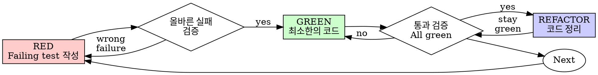

# 테스트 구동 개발 (Test-Driven Development, TDD)

## 개요

테스트를 먼저 작성하세요. 실패하는 것을 지켜보세요. 통과하기 위한 최소한의 코드만 작성하세요.

**핵심 원칙:** 테스트가 실패하는 것을 직접 지켜보지 않았다면, 해당 테스트가 올바른 대상을 검증하는지 알 수 없습니다.

**규칙의 문구를 위반하는 것은 규칙의 정신을 위반하는 것입니다.**

## 언제 사용해야 하는가

**항상:**
- 새로운 기능 구현
- 버그 수정
- 리팩터링
- 동작 변경

**예외 사항 (사람 파트너에게 문의):**
- 일회성 프로토타입
- 자동 생성된 코드
- 설정 파일

"이번 한 번만 TDD를 건너뛸까?"라는 생각이 드나요? 멈추세요. 그것은 자기합리화입니다.

## 절대 법칙 (The Iron Law)

```
실패하는 테스트 없이 작성되는 프로덕션 코드는 존재하지 않는다
```

테스트보다 코드를 먼저 작성했나요? 삭제하세요. 다시 시작하세요.

**예외는 없습니다:**
- "참고용"으로 남겨두지 마세요
- 테스트를 작성하면서 코드를 "수정"하지 마세요
- 훔쳐보지 마세요
- 삭제는 완전한 삭제를 의미합니다

테스트부터 새로 구현하세요. 예외는 없습니다.

## Red-Green-Refactor



### RED - 실패하는 테스트 작성

어떤 결과가 일어나야 하는지 보여주는 최소한의 테스트를 하나 작성하세요.

<Good>
```typescript
test('retries failed operations 3 times', async () => {
  let attempts = 0;
  const operation = () => {
    attempts++;
    if (attempts < 3) throw new Error('fail');
    return 'success';
  };

  const result = await retryOperation(operation);

  expect(result).toBe('success');
  expect(attempts).toBe(3);
});
```
명확한 이름, 실제 동작 검증, 단일 목적
</Good>

<Bad>
```typescript
test('retry works', async () => {
  const mock = jest.fn()
    .mockRejectedValueOnce(new Error())
    .mockRejectedValueOnce(new Error())
    .mockResolvedValueOnce('success');
  await retryOperation(mock);
  expect(mock).toHaveBeenCalledTimes(3);
});
```
모호한 이름, 코드가 아닌 모의 객체(mock) 검증
</Bad>

**요구 사항:**
- 단 하나의 동작
- 명확한 이름
- 실제 코드 (불가피한 경우가 아니면 mock 지양)

### Verify RED - 실패 확인

**필수 항목. 절대로 건너뛰지 마세요.**

```bash
npm test path/to/test.test.ts
```

확인 사항:
- 테스트가 실패하는가 (오류/에러가 아님)
- 실패 메시지가 예상과 일치하는가
- 오타가 아닌 기능 부재로 인해 실패했는가

**테스트가 통과하나요?** 기존 동작을 테스트하고 있는 것입니다. 테스트를 수정하세요.

**테스트에서 에러가 발생하나요?** 에러를 고치고 올바르게 실패할 때까지 다시 실행하세요.

### GREEN - 최소한의 코드 작성

테스트를 통과하기 위한 가장 간단한 코드를 작성하세요.

<Good>
```typescript
async function retryOperation<T>(fn: () => Promise<T>): Promise<T> {
  for (let i = 0; i < 3; i++) {
    try {
      return await fn();
    } catch (e) {
      if (i === 2) throw e;
    }
  }
  throw new Error('unreachable');
}
```
통과하기에 딱 충분한 정도
</Good>

<Bad>
```typescript
async function retryOperation<T>(
  fn: () => Promise<T>,
  options?: {
    maxRetries?: number;
    backoff?: 'linear' | 'exponential';
    onRetry?: (attempt: number) => void;
  }
): Promise<T> {
  // YAGNI
}
```
오버 엔지니어링 (과도한 설계)
</Bad>

테스트 범위를 넘어서는 기능을 추가하거나, 다른 코드를 리팩터링하거나, "개선"하려 하지 마세요.

### Verify GREEN - 통과 확인

**필수 항목.**

```bash
npm test path/to/test.test.ts
```

확인 사항:
- 테스트가 통과하는가
- 다른 기존 테스트들도 여전히 통과하는가
- 출력이 깨끗한가 (에러, 경고 없음)

**테스트가 실패하나요?** 테스트가 아니라 코드를 수정하세요.

**다른 테스트가 실패하나요?** 즉시 수정하세요.

### REFACTOR - 코드 정리

오직 Green 상태에 도달한 후에만 진행하세요:
- 중복 제거
- 이름 개선
- 헬퍼 함수 추출

테스트를 그린 상태로 유지하세요. 새로운 동작을 추가하지 마세요.

### 반복

다음 기능을 위해 다음 실패하는 테스트를 작성하세요.

## 좋은 테스트의 요건

| 품질 | 좋은 예 (Good) | 나쁜 예 (Bad) |
|---------|------|-----|
| **최소성 (Minimal)** | 단 하나의 목적. 이름에 "and"가 들어가나요? 분리하세요. | `test('validates email and domain and whitespace')` |
| **명확성 (Clear)** | 이름이 동작을 설명함 | `test('test1')` |
| **의도 표현 (Shows intent)** | 원하는 API를 명확히 보여줌 | 코드가 해야 할 일을 흐리게 만듦 |

## 순서가 중요한 이유

**"작동하는지 확인하려고 나중에 테스트를 작성할게요"**

코드 작성 후 만들어진 테스트는 즉시 통과합니다. 즉시 통과하는 테스트는 아무것도 증명하지 못합니다:
- 잘못된 대상을 테스트할 수 있음
- 동작이 아닌 구현 상세를 테스트할 수 있음
- 잊어버린 엣지 케이스를 놓칠 수 있음
- 테스트가 버그를 잡아내는 순간을 결코 확인하지 못함

Test-first 방식은 테스트가 실패하는 것을 확인하도록 강제함으로써, 해당 테스트가 실제로 무언가를 검증한다는 점을 증명합니다.

**"이미 모든 엣지 케이스를 수동으로 테스트했습니다"**

수동 테스트는 즉흥적(ad-hoc)입니다. 모든 것을 테스트했다고 생각하지만:
- 테스트한 내용에 대한 기록이 없음
- 코드가 변경되었을 때 다시 실행할 수 없음
- 압박감이 있는 상황에서 케이스를 잊기 쉬움
- "내가 시도했을 땐 잘 됐음" ≠ 포괄적 검증

자동화된 테스트는 체계적입니다. 매번 동일한 방식으로 실행됩니다.

**"X시간 동안 작업한 것을 삭제하는 것은 낭비입니다"**

매몰 비용의 오류(Sunk cost fallacy)입니다. 지나간 시간은 돌아오지 않습니다. 당신의 현재 선택지:
- 삭제 후 TDD로 재작성 (X시간 추가 소요, 높은 신뢰도)
- 유지하고 나중에 테스트 추가 (30분 소요, 낮은 신뢰도, 버그 가능성 높음)

진짜 "낭비"는 신뢰할 수 없는 코드를 유지하는 것입니다. 실제 검증이 없는 작동 코드는 기술 부채일 뿐입니다.

**"TDD는 교조적이며, 실용적인 것은 상황에 맞게 조율하는 것입니다"**

TDD야말로 가장 실용적(pragmatic)입니다:
- 커밋 전 버그 발견 (나중에 디버깅하는 것보다 빠름)
- 회귀 방지 (테스트가 파손을 즉시 감지)
- 동작 문서화 (테스트가 코드 사용 방법을 보여줌)
- 리팩터링 가능 (자유롭게 변경해도 테스트가 문제 감지)

"실용적"이라는 핑계의 지름길 = 프로덕션에서의 디버깅 = 오히려 느려짐.

**"나중에 테스트해도 동일한 목적을 달성할 수 있습니다 - 요식 행위가 아니라 정신이 중요하니까요"**

아닙니다. 나중에 작성하는 테스트는 "이 코드가 무엇을 하는가?"에 답합니다. 먼저 작성하는 테스트는 "이 코드가 무엇을 해야 하는가?"에 답합니다.

나중에 작성하는 테스트는 당신의 구현 방식에 편향됩니다. 요구 사항이 아닌 자신이 작성한 내용을 테스트하게 되며, 새로 발견된 케이스가 아니라 기억나는 엣지 케이스만 검증하게 됩니다.

먼저 작성하는 테스트는 구현 전에 엣지 케이스를 발견하도록 강제합니다. 나중에 작성하는 테스트는 스스로가 모든 것을 기억했는지 검증할 뿐입니다 (그리고 당신은 다 기억하지 못합니다).

개발 후 30분 동안 작성하는 테스트 ≠ TDD. 커버리지는 얻을지 몰라도 테스트가 제 기능을 한다는 증거는 잃게 됩니다.

## 흔한 자기합리화

| 핑계 | 현실 |
|--------|---------|
| "너무 간단해서 테스트할 필요가 없음" | 간단한 코드도 깨집니다. 테스트 작성에는 30초밖에 걸리지 않습니다. |
| "나중에 테스트할게요" | 즉시 통과하는 테스트는 아무것도 증명하지 못합니다. |
| "나중에 테스트해도 같은 목적을 달성함" | 나중에 작성하는 테스트 = "이게 뭘 하지?", 먼저 작성하는 테스트 = "이게 뭘 해야 하지?" |
| "이미 수동으로 테스트했음" | 즉흥적 검증 ≠ 체계적 검증. 기록이 없고 재실행이 불가함. |
| "X시간 작업물을 삭제하는 건 낭비임" | 매몰 비용의 오류. 검증되지 않은 코드를 남겨두는 것이 기술 부채임. |
| "참고용으로 남겨두고 테스트를 먼저 쓸게요" | 결국 코드를 수정해 맞추게 됩니다. 그게 바로 사후 테스트입니다. 삭제는 완전한 삭제를 의미합니다. |
| "먼저 탐색해볼 필요가 있음" | 좋습니다. 탐색한 코드는 버리고 TDD로 새로 시작하세요. |
| "테스트 작성이 어려움 = 설계가 불분명함" | 테스트의 소리에 귀 기울이세요. 테스트하기 어렵다면 사용하기도 어렵습니다. |
| "TDD는 속도를 떨어뜨림" | TDD가 디버깅보다 빠릅니다. 실용적 = test-first. |
| "수동 테스트가 더 빠름" | 수동 검증은 엣지 케이스를 증명하지 못하며, 변경할 때마다 다시 테스트해야 합니다. |
| "기존 코드에 테스트가 없음" | 당신이 코드를 개선하고 있는 중입니다. 기존 코드에도 테스트를 추가하세요. |

## Red Flags - 즉시 중단하고 다시 시작할 신호

- 테스트 전에 작성된 코드
- 구현 후에 작성된 테스트
- 즉시 통과하는 테스트
- 테스트가 왜 실패했는지 설명할 수 없음
- "나중에" 추가된 테스트
- "이번 한 번만"이라며 합리화함
- "이미 수동으로 테스트했음"
- "나중에 작성해도 목적은 동일함"
- "요식 행위가 아니라 정신이 중요한 것임"
- "참고용으로 남겨둠" 또는 "기존 코드 수정"
- "이미 X시간이나 썼으니 삭제는 낭비임"
- "TDD는 교조적이며 나는 실용적으로 하는 것임"
- "이 케이스는 특별히 다른 이유가..."

**이 모든 신호의 의미: 코드를 삭제하세요. TDD로 다시 시작하세요.**

## 예시: 버그 수정

**버그:** 빈 이메일 입력이 허용됨

**RED**
```typescript
test('rejects empty email', async () => {
  const result = await submitForm({ email: '' });
  expect(result.error).toBe('Email required');
});
```

**Verify RED**
```bash
$ npm test
FAIL: expected 'Email required', got undefined
```

**GREEN**
```typescript
function submitForm(data: FormData) {
  if (!data.email?.trim()) {
    return { error: 'Email required' };
  }
  // ...
}
```

**Verify GREEN**
```bash
$ npm test
PASS
```

**REFACTOR**
필요에 따라 여러 필드 검증 로직을 추출합니다.

## 검증 체크리스트

작업을 완료로 표시하기 전에:

- [ ] 모든 새로운 함수/메서드에 대한 테스트가 존재하는가
- [ ] 구현 전 각 테스트가 실패하는 것을 지켜보았는가
- [ ] 각 테스트가 예상된 이유로 실패했는가 (오타가 아닌 기능 부재)
- [ ] 각 테스트를 통과하기 위한 최소한의 코드만 작성했는가
- [ ] 모든 테스트가 통과했는가
- [ ] 출력이 깨끗한가 (에러, 경고 없음)
- [ ] 테스트가 실제 코드를 사용하는가 (불가피한 경우에만 mock 사용)
- [ ] 엣지 케이스 및 에러 케이스가 다뤄졌는가

모든 항목을 체크할 수 없나요? TDD를 건너뛰신 것입니다. 다시 시작하세요.

## 난관에 부딪혔을 때

| 문제 | 해결책 |
|---------|----------|
| 테스트 작성 방법을 모르겠음 | 바라는 API를 먼저 써보세요. 단정문(assertion)부터 작성하세요. 사람 파트너에게 물어보세요. |
| 테스트가 너무 복잡함 | 설계가 너무 복잡한 것입니다. 인터페이스를 단순화하세요. |
| 모든 것을 mock해야 함 | 코드가 너무 강하게 결합되어 있습니다. 의존성 주입(dependency injection)을 사용하세요. |
| 테스트 셋업이 너무 큼 | 헬퍼를 추출하세요. 그래도 복잡한가요? 설계를 단순화하세요. |

## 디버깅 통합

버그를 발견하셨나요? 버그를 재현하는 실패 테스트를 작성하세요. TDD 사이클을 따르세요. 테스트는 수정 사항을 증명하고 회귀(regression)를 방지해 줍니다.

테스트 없이 버그를 절대 고치지 마세요.

## 테스트 안티 패턴

mock이나 테스트 유틸리티를 추가할 때는 흔한 실수를 방지하기 위해 [testing-anti-patterns.md](testing-anti-patterns.md) 문서를 읽어보세요:
- 실제 동작 대신 mock 동작을 테스트하는 행위
- 프로덕션 클래스에 테스트 전용 메서드를 추가하는 행위
- 의존성을 이해하지 않고 mock을 사용하는 행위

## 최종 규칙

```
프로덕션 코드 → 테스트가 존재하며 먼저 실패했어야 함
그렇지 않은 경우 → TDD가 아님
```

사람 파트너의 허락 없이는 예외가 없습니다.
