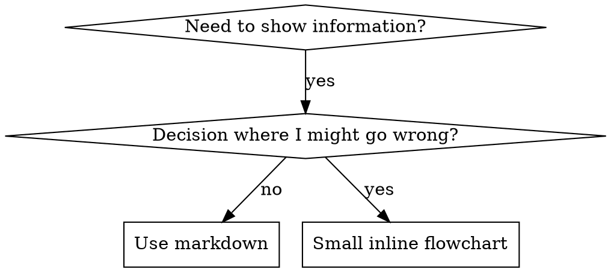

# 스킬 작성하기 (Writing Skills)

## 개요 (Overview)

**스킬 작성을 프로세스 문서에 적용한 것 자체가 바로 테스트 주도 개발(TDD)입니다.**

**개인 스킬은 런타임의 스킬 디렉토리에 저장됩니다.**

테스트 케이스(서브에이전트를 활용한 압박 시나리오)를 작성하고, 실패하는 것을 관찰하고 (베이스라인 동작), 스킬(문서)을 작성하고, 테스트가 통과하는 것을 관찰하며 (에이전트 준수), 리팩토링합니다 (허점 차단).

**핵심 원칙:** 스킬 없이 에이전트가 실패하는 것을 관찰하지 않았다면, 해당 스킬이 올바른 내용을 가르치고 있는지 알 수 없습니다.

**필수 배경 지식:** 이 스킬을 사용하기 전에 superpowers:test-driven-development를 반드시 이해해야 합니다. 해당 스킬은 기본적인 RED-GREEN-REFACTOR 사이클을 정의합니다. 본 스킬은 TDD를 문서화 작업에 맞게 변형하여 적용합니다.

**공식 지침:** Anthropic의 공식 스킬 작성 모범 사례는 anthropic-best-practices.md를 참조하세요. 해당 문서는 본 스킬의 TDD 중심 접근 방식을 보완하는 추가적인 패턴과 지침을 제공합니다.

## 스킬이란 무엇인가? (What is a Skill?)

**스킬**은 입증된 기법, 패턴 또는 툴에 대한 참조 가이드입니다. 스킬은 향후 에이전트가 효과적인 접근 방식을 찾고 적용할 수 있도록 돕습니다.

**스킬이란:** 재사용 가능한 기법, 패턴, 툴, 참조 가이드

**스킬이 아닌 것:** 문제 하나를 어떻게 해결했는지에 대한 서술적 기행문

## 스킬 생성을 위한 TDD 매핑 (TDD Mapping for Skills)

| TDD 개념 (TDD Concept) | 스킬 생성 (Skill Creation) |
|-------------|----------------|
| **테스트 케이스 (Test case)** | 서브에이전트를 포함한 압박 시나리오 |
| **프로덕션 코드 (Production code)** | 스킬 문서 (SKILL.md) |
| **테스트 실패 (RED)** | 스킬이 없을 때 에이전트가 규칙을 위반함 (베이스라인) |
| **테스트 통과 (GREEN)** | 스킬이 제공되었을 때 에이전트가 규칙을 준수함 |
| **리팩토링 (Refactor)** | 규칙 준수를 유지하면서 허점을 차단함 |
| **테스트 먼저 작성** | 스킬을 작성하기 전에 베이스라인 시나리오 실행 |
| **실패 관찰** | 에이전트가 사용하는 정확한 합리화 문구 문서화 |
| **최소한의 코드** | 해당 특정 위반 사항을 해결하는 스킬 작성 |
| **통과 관찰** | 에이전트가 이제 준수하는지 검증 |
| **리팩토링 사이클** | 새로운 합리화 발견 → 차단 → 재검증 |

전체 스킬 생성 프로세스는 RED-GREEN-REFACTOR 사이클을 따릅니다.

## 스킬 생성 시점 (When to Create a Skill)

**생성해야 하는 경우:**
- 기법이 본인에게 직관적으로 명확하지 않았을 때
- 프로젝트를 넘나들며 이를 다시 참조하려 할 때
- 패턴이 광범위하게 적용될 때 (특정 프로젝트에 국한되지 않음)
- 다른 사람들에게 유용할 때

**생성하지 말아야 하는 경우:**
- 일회성 해결책
- 다른 곳에 문서화가 잘 되어 있는 표준 관행
- 프로젝트 전용 컨벤션 (자신의 지침 파일에 넣을 것)
- 기계적 제약 조건 (regex/검증으로 강제할 수 있다면 자동화할 것 — 문서화는 판단이 필요한 영역을 위해 남겨둠)

## 스킬 유형 (Skill Types)

### 기법 (Technique)
따라야 할 단계가 포함된 구체적인 방법 (condition-based-waiting, root-cause-tracing)

### 패턴 (Pattern)
문제를 생각하는 방식 (flatten-with-flags, test-invariants)

### 참조 (Reference)
API 문서, 문법 가이드, 툴 문서화 (office docs)

## 디렉토리 구조 (Directory Structure)

```
skills/
  skill-name/
    SKILL.md              # 메인 참조 문서 (필수)
    supporting-file.*     # 필요한 경우에만 추가
```

**단일 층위 네임스페이스 (Flat namespace)** - 모든 스킬이 하나의 검색 가능한 네임스페이스에 존재함

**다음의 경우 파일 분리:**
1. **분량이 큰 참조 문서** (100줄 이상) - API 문서, 포괄적 문법 안내
2. **재사용 가능한 툴** - 스크립트, 유틸리티, 템플릿

**인라인으로 유지할 항목:**
- 원칙 및 개념
- 코드 패턴 (< 50줄)
- 기타 모든 내용

## SKILL.md 구조 (SKILL.md Structure)

**Frontmatter (YAML):**
- 2개 필수 필드: `name` 및 `description` (지원되는 전체 필드는 [agentskills.io/specification](https://agentskills.io/specification) 참조)
- 전체 최대 1024자
- `name`: 영문자, 숫자, 하이픈만 사용 (괄호, 특수문자 금지)
- `description`: 3인칭, 언제 사용하는지'만' 설명 (스킬이 무엇을 하는지는 작성하지 않음)
  - 트리거 조건에 집중하기 위해 "Use when..."으로 시작
  - 구체적인 증상, 상황 및 컨텍스트 포함
  - **절대로 스킬의 프로세스나 워크플로우를 요약하지 말 것** (이유는 SDO 섹션 참조)
  - 가능하면 500자 미만으로 유지

```markdown
---
name: Skill-Name-With-Hyphens
description: Use when [specific triggering conditions and symptoms]
---

# Skill Name

## Overview
What is this? Core principle in 1-2 sentences.

## When to Use
[Small inline flowchart IF decision non-obvious]

Bullet list with SYMPTOMS and use cases
When NOT to use

## Core Pattern (for techniques/patterns)
Before/after code comparison

## Quick Reference
Table or bullets for scanning common operations

## Implementation
Inline code for simple patterns
Link to file for heavy reference or reusable tools

## Common Mistakes
What goes wrong + fixes

## Real-World Impact (optional)
Concrete results
```

## 스킬 탐색 최적화 (Skill Discovery Optimization, SDO)

**탐색 시 결정적 요소:** 향후 에이전트가 여러분의 스킬을 찾을 수 있어야 합니다

### 1. 풍부한 Description 필드

**목적:** 에이전트는 설명(description)을 읽고 특정 작업에 대해 어떤 스킬을 로드할지 결정합니다. "내가 지금 이 스킬을 읽어야 하는가?"에 답하도록 만드세요.

**포맷:** 트리거 조건에 집중하기 위해 "Use when..."으로 시작하세요.

**중요: 설명(Description) = 사용 시점, 스킬이 하는 일이 아님**

설명에는 트리거 조건만 포함되어야 합니다. 설명에서 스킬의 프로세스나 워크플로우를 요약하지 마세요.

**이것이 중요한 이유:** 테스트 결과, 설명이 스킬의 워크플로우를 요약하고 있으면 에이전트가 전체 스킬 내용을 읽는 대신 설명을 그대로 따라갈 위험이 나타났습니다. "태스크 사이에 코드 검토"라는 설명이 추가되자, 에이전트는 플로우차트에 명확히 2번의 검토(명세서 준수 후 코드 품질)가 표시되어 있었음에도 불구하고 단 1번의 검토만 수행했습니다.

설명을 단순 "Use when executing implementation plans with independent tasks" (워크플로우 요약 없음)로 수정하자, 에이전트는 플로우차트를 올바르게 읽고 2단계 검토 프로세스를 정상 수행했습니다.

**함정:** 워크플로우를 요약하는 설명은 에이전트가 지름길을 택하도록 만듭니다. 본문 내용은 에이전트가 건너뛰는 문서가 되어버립니다.

```yaml
# ❌ 나쁨: 워크플로우 요약 - 에이전트가 스킬을 읽는 대신 이를 따를 수 있음
description: Use when executing plans - dispatches subagent per task with code review between tasks

# ❌ 나쁨: 너무 많은 프로세스 세부사항
description: Use for TDD - write test first, watch it fail, write minimal code, refactor

# ✅ 좋음: 트리거 조건만 작성, 워크플로우 요약 없음
description: Use when executing implementation plans with independent tasks in the current session

# ✅ 좋음: 트리거 조건만 작성
description: Use when implementing any feature or bugfix, before writing implementation code
```

**내용:**
- 이 스킬이 적용된다는 신호를 주는 구체적인 트리거, 증상 및 상황을 사용하세요
- 언어에 종속된 증상(setTimeout, sleep)이 아니라 문제 자체(레이스 조건, 불일치 동작)를 설명하세요
- 스킬 자체가 특정 기술에 국한되지 않는 한 트리거를 기술 중립적으로 유지하세요
- 스킬이 특정 기술에 종속된 경우 트리거에 이를 명시하세요
- 3인칭으로 작성하세요 (시스템 프롬프트에 주입됨)
- **절대로 스킬의 프로세스나 워크플로우를 요약하지 마세요**

```yaml
# ❌ 나쁨: 너무 추상적이고 모호하며 언제 사용하는지 포함되지 않음
description: For async testing

# ❌ 나쁨: 1인칭 표현
description: I can help you with async tests when they're flaky

# ❌ 나쁨: 기술을 언급했으나 스킬이 해당 기술에 국한되지 않음
description: Use when tests use setTimeout/sleep and are flaky

# ✅ 좋음: "Use when"으로 시작하고 문제를 설명하며 워크플로우 요약이 없음
description: Use when tests have race conditions, timing dependencies, or pass/fail inconsistently

# ✅ 좋음: 명시적 트리거가 포함된 특정 기술 전용 스킬
description: Use when using React Router and handling authentication redirects
```

### 2. 키워드 커버리지 (Keyword Coverage)

에이전트가 검색할 법한 단어들을 사용하세요:
- 에러 메시지: "Hook timed out", "ENOTEMPTY", "race condition"
- 증상: "flaky", "hanging", "zombie", "pollution"
- 유의어: "timeout/hang/freeze", "cleanup/teardown/afterEach"
- 툴: 실제 명령어, 라이브러리 이름, 파일 타입

### 3. 설명적인 명명법 (Descriptive Naming)

**능동태 및 동사 우선 사용:**
- ✅ `creating-skills` (not `skill-creation`)
- ✅ `condition-based-waiting` (not `async-test-helpers`)

### 4. 토큰 효율성 (결정적 요소)

**문제점:** getting-started 및 자주 참조되는 스킬은 모든 대화에 로드됩니다. 토큰 하나하나가 중요합니다.

**목표 단어 수:**
- getting-started 워크플로우: 각 <150단어
- 자주 로드되는 스킬: 전체 <200단어
- 기타 스킬: <500단어 (여전히 간결해야 함)

**기법:**

**세부사항은 툴 도움말(help)로 이동:**
```bash
# ❌ 나쁨: 모든 플래그를 SKILL.md에 문서화
search-conversations supports --text, --both, --after DATE, --before DATE, --limit N

# ✅ 좋음: --help 참조
search-conversations supports multiple modes and filters. Run --help for details.
```

**상호 참조 활용:**
```markdown
# ❌ 나쁨: 워크플로우 세부사항 반복
When searching, dispatch subagent with template...
[20 lines of repeated instructions]

# ✅ 좋음: 다른 스킬 참조
Always use subagents (50-100x context savings). REQUIRED: Use [other-skill-name] for workflow.
```

**예시 압축:**
```markdown
# ❌ 나쁨: 장황한 예시 (42 단어)
your human partner: "How did we handle authentication errors in React Router before?"
You: I'll search past conversations for React Router authentication patterns.
[Dispatch subagent with search query: "React Router authentication error handling 401"]

# ✅ 좋음: 최소한의 예시 (20 단어)
Partner: "How did we handle auth errors in React Router?"
You: Searching...
[Dispatch subagent → synthesis]
```

**중복 제거:**
- 상호 참조된 스킬에 있는 내용 반복하지 않기
- 명령어만 보고도 명확한 내용 설명하지 않기
- 동일 패턴의 예시를 여러 개 포함하지 않기

**검증:**
```bash
wc -w skills/path/SKILL.md
# getting-started workflows: aim for <150 each
# Other frequently-loaded: aim for <200 total
```

**수행하는 작업이나 핵심 인사이트로 이름 지을 것:**
- ✅ `condition-based-waiting` > `async-test-helpers`
- ✅ `using-skills` not `skill-usage`
- ✅ `flatten-with-flags` > `data-structure-refactoring`
- ✅ `root-cause-tracing` > `debugging-techniques`

**동명사(-ing)는 프로세스에 잘 들어맞습니다:**
- `creating-skills`, `testing-skills`, `debugging-with-logs`
- 능동적이며 취하고 있는 조치를 설명함

### 5. 다른 스킬 상호 참조

**다른 스킬을 참조하는 문서를 작성할 때:**

명시적 필수 마커를 사용하여 스킬 이름만 기술하세요:
- ✅ 좋음: `**REQUIRED SUB-SKILL:** Use superpowers:test-driven-development`
- ✅ 좋음: `**REQUIRED BACKGROUND:** You MUST understand superpowers:systematic-debugging`
- ❌ 나쁨: `See skills/testing/test-driven-development` (필수 여부 불명확)
- ❌ 나쁨: `@skills/testing/test-driven-development/SKILL.md` (강제 로드되어 컨텍스트 낭비)

**@ 링크를 쓰지 않는 이유:** `@` 구문은 파일을 즉시 강제 로드하여 필요하기도 전에 20만 개 이상의 컨텍스트를 소모합니다.

## 플로우차트 사용법 (Flowchart Usage)



**다음의 경우에만 플로우차트 사용:**
- 명확하지 않은 의사 결정 지점
- 너무 일찍 중단할 위험이 있는 프로세스 루프
- "A 대 B 중 무엇을 사용할지" 결정할 때

**다음의 경우 절대로 플로우차트 사용 금지:**
- 참조 자료 → 테이블, 리스트
- 코드 예시 → 마크다운 블록
- 선형 지침 → 번호 매기기 리스트
- 의미적 의미가 없는 라벨 (step1, helper2)

graphviz 스타일 규칙은 이 디렉토리의 `graphviz-conventions.dot`을 참조하세요.

**인간 파트너를 위해 시각화하기:** 스킬의 플로우차트를 SVG로 렌더링하려면 이 디렉토리의 `render-graphs.js`를 사용하세요:
```bash
./render-graphs.js ../some-skill           # Each diagram separately
./render-graphs.js ../some-skill --combine # All diagrams in one SVG
```

## 코드 예시 (Code Examples)

**하나의 훌륭한 예시가 여러 개의 평범한 예시보다 낫습니다**

가장 관련성 높은 언어를 선택하세요:
- 테스트 기법 → TypeScript/JavaScript
- 시스템 디버깅 → Shell/Python
- 데이터 처리 → Python

**좋은 예시:**
- 완전하고 실행 가능함
- 이유를 설명하는 주석이 잘 달려 있음
- 실제 시나리오에서 추출됨
- 패턴을 명확히 보여줌
- 변형하여 적용할 준비가 됨 (일반 템플릿 아님)

**피해야 할 점:**
- 5개 이상의 언어로 똑같이 구현
- 빈칸 채우기식 템플릿 생성
- 인위적인 예시 작성

당신은 언어 간 포팅 능력이 뛰어납니다 - 하나의 훌륭한 예시면 충분합니다.

## 파일 조직화 (File Organization)

### 자체 포함형 스킬 (Self-Contained Skill)
```
defense-in-depth/
  SKILL.md    # Everything inline
```
시점: 모든 내용이 들어가며 대용량 참조 문서가 필요 없을 때

### 재사용 가능한 툴이 포함된 스킬 (Skill with Reusable Tool)
```
condition-based-waiting/
  SKILL.md    # Overview + patterns
  example.ts  # Working helpers to adapt
```
시점: 툴이 단순 글이 아닌 재사용 가능한 코드일 때

### 대용량 참조 파일이 포함된 스킬 (Skill with Heavy Reference)
```
pptx/
  SKILL.md       # Overview + workflows
  pptxgenjs.md   # 600 lines API reference
  ooxml.md       # 500 lines XML structure
  scripts/       # Executable tools
```
시점: 참조 자료가 인라인으로 넣기에 너무 클 때

## 철칙 (TDD와 동일)

```
실패하는 테스트 없이 작성되는 스킬은 없다
```

이는 새로운 스킬 및 기존 스킬의 **수정** 모두에 적용됩니다.

테스트 전에 스킬을 작성했나요? 지우세요. 다시 시작하세요.
테스트 없이 스킬을 수정했나요? 동일한 위반입니다.

**예외 없음:**
- "단순 추가"라고 해서 예외 없음
- "섹션 하나만 추가"라고 해서 예외 없음
- "문서 업데이트"라고 해서 예외 없음
- 검증되지 않은 변경 사항을 "참고용"으로 남겨두지 말 것
- 테스트를 실행하는 동안 "적응"시키지 말 것
- 삭제는 진짜 삭제를 의미함

**필수 배경 지식:** superpowers:test-driven-development 스킬이 이 원칙이 왜 중요한지 설명합니다. 동일한 원칙이 문서화에도 적용됩니다.

## 모든 스킬 유형 테스트하기 (Testing All Skill Types)

스킬 유형마다 다른 테스트 접근 방식이 필요합니다:

### 규율 강제형 스킬 (Discipline-Enforcing Skills - 규칙/요구사항)

**예시:** TDD, verification-before-completion, designing-before-coding

**테스트 방법:**
- 학술적 질문: 규칙을 이해하고 있는가?
- 압박 시나리오: 스트레스 상황에서도 준수하는가?
- 복합 압박 요소: 시간 + 매몰 비용 + 피로
- 합리화 패턴을 식별하고 명시적인 대응책 추가

**성공 기준:** 최대 압박 속에서도 에이전트가 규칙을 준수함

### 기법 스킬 (Technique Skills - 가이드/노하우)

**예시:** condition-based-waiting, root-cause-tracing, defensive-programming

**테스트 방법:**
- 적용 시나리오: 기법을 올바르게 적용할 수 있는가?
- 변형 시나리오: 엣지 케이스를 처리할 수 있는가?
- 정보 누락 테스트: 지침에 빈 곳이 없는가?

**성공 기준:** 에이전트가 새로운 시나리오에 기법을 성공적으로 적용함

### 패턴 스킬 (Pattern Skills - 정신적 모델)

**예시:** reducing-complexity, information-hiding 개념들

**테스트 방법:**
- 인지 시나리오: 패턴이 적용되는 시점을 알아채는가?
- 적용 시나리오: 정신적 모델을 사용할 수 있는가?
- 반대 예시: 적용하지 말아야 할 때를 아는가?

**성공 기준:** 에이전트가 패턴을 적용할 시점과 방법을 올바르게 식별함

### 참조 스킬 (Reference Skills - 문서/API)

**예시:** API 문서, 명령어 참조, 라이브러리 가이드

**테스트 방법:**
- 탐색 시나리오: 올바른 정보를 찾아낼 수 있는가?
- 적용 시나리오: 찾아낸 정보를 올바르게 사용할 수 있는가?
- 공백 테스트: 일반적인 유스케이스가 모두 포함되었는가?

**성공 기준:** 에이전트가 참조 정보를 찾아서 올바르게 적용함

## 테스트를 건너뛰기 위한 흔한 합리화 문구들

| 핑계 (Excuse) | 실제 (Reality) |
|--------|---------|
| "Skill is obviously clear" | 나에게 명확하다고 다른 에이전트에게 명확한 것은 아닙니다. 테스트하세요. |
| "It's just a reference" | 참조 문서에도 구멍이나 불명확한 섹션이 있습니다. 검색/탐색을 테스트하세요. |
| "Testing is overkill" | 테스트되지 않은 스킬에는 문제가 존재합니다. 예외 없이. 15분의 테스트가 수시간을 아껴줍니다. |
| "I'll test if problems emerge" | 문제가 나온다는 것은 에이전트가 스킬을 쓸 수 없다는 뜻입니다. 배포 전에 테스트하세요. |
| "Too tedious to test" | 테스트하는 것이 프로덕션에서 나쁜 스킬을 디버깅하는 것보다 훨씬 덜 번거롭습니다. |
| "I'm confident it's good" | 과도한 자신감은 문제를 보장합니다. 그래도 테스트하세요. |
| "Academic review is enough" | 읽는 것과 사용하는 것은 다릅니다. 적용 시나리오를 테스트하세요. |
| "No time to test" | 검증되지 않은 스킬을 배포하면 나중에 수정하는 데 더 많은 시간을 낭비하게 됩니다. |

**이 모든 문구의 결론: 배포 전에 테스트할 것. 예외 없음.**

## 실패 유형에 맞는 형식을 채택하기 (Match the Form to the Failure)

지침을 작성하기 전에 베이스라인 실패를 먼저 분류하세요. 한 실패 유형을 철통 방어하는 포맷이 다른 실패 유형에는 측정 가능한 해를 끼칠 수 있습니다.

| 베이스라인 실패 | 올바른 형식 | 잘못된 형식 |
|---|---|---|
| 압박 속에서 규칙을 건너뛰거나 위반함 (알면서도 위반) | 금지 조항 + 합리화 테이블 + Red Flags (아래 철통 방어 섹션 참조) | 부드러운 안내 ("prefer...", "consider...") |
| 규칙은 따르나 출력이 잘못된 형태를 띰 (과도한 프롬프트, 묻힌 판정, 명세서 재진술) | 긍정적인 레시피 또는 계약: 출력이 무엇인지 순서대로 정의 | 금지 목록 ("don't restate", "never narrate") |
| 이미 생성 중인 항목에서 필수 요소를 누락함 | 구조적 형식: 작성할 템플릿 내의 REQUIRED 필드/슬롯 | 템플릿 근처의 텍스트 리마인더 |
| 동작이 조건에 따라 달라져야 함 | 관찰 가능한 조건에 연결된 조건문 ("if the brief exists, reference it") | 무조건적인 규칙 + 예외 조항 |

**형태 변경 문제에 금지 조항이 역효과를 내는 이유:** 경쟁적인 유인("프롬프트를 자체 포함되게 만들라") 아래에서 에이전트는 "X를 하지 말 것"이라는 항목과 협상을 시작합니다. 파견 프롬프트 지침에 대한 맞대결 작성 테스트에서, 금지 조항 그룹은 레시피 그룹보다 원치 않는 콘텐츠를 훨씬 더 많이 생성했으며(완전히 분리된 분포), 지침이 전혀 없는 대조군보다도 나쁜 경향을 보였습니다. 짐작으로 작성하지 말고 자체 케이스를 미세 테스트해보세요. 기본값으로 금지 조항을 선택해서는 안 됩니다. 레시피는 협상의 여지를 남기지 않습니다: 출력 결과가 지정된 형태와 일치하거나 일치하지 않거나 둘 중 하나입니다.

**어떤 형식을 선택하든 적용되는 규칙:**
- **뉘앙스 조항 금지.** "중요하지 않다면 X를 하지 말 것"은 협상을 다시 엽니다 - 우수한 레시피에 단 하나의 뉘앙스 조항을 추가한 것만으로 동일 테스트에서 일관된 성능이 노이즈 섞인 성능으로 저하되었습니다. 실제 예외 상황은 관찰 가능한 조건에 대한 자체 조건문으로 표현하세요.
- **예외 조항은 범위를 제한하지 못함.** "이 제한은 코드 블록에는 적용되지 않음"이라고 써도 여전히 코드 블록을 억제합니다. 출력의 일부가 면제되어야 한다면 규칙이 해당 부분에 도달하지 못하도록 구조를 재조정하세요.

## 합리화에 대항하여 스킬 철통 방어화하기 (Bulletproofing Skills Against Rationalization)

규율을 강제하는 스킬(TDD 등)은 합리화 시도에 저항할 수 있어야 합니다. 에이전트는 똑똑하므로 압박 상황에서 허점을 찾아낼 것입니다.

**적용 범위:** 이 툴킷은 규율 실패(에이전트가 규칙을 알면서도 압박 시 건너뛰는 경우)를 위한 것입니다. 출력 형태가 잘못되었거나 요소가 누락된 경우 금지 기반 철통 방어화는 역효과를 냅니다; 대신 '실패 유형에 맞는 형식을 채택하기' 섹션의 형식을 사용하세요.

**심리학 노트:** 설득 기법이 왜 작용하는지 이해하면 이를 체계적으로 적용하는 데 도움이 됩니다. 권위, 헌신, 희소성, 사회적 증거 및 연대감 원칙에 대한 연구 기반은 persuasion-principles.md를 참조하세요.

### 모든 허점을 명시적으로 차단할 것

단순히 규칙만 제시하지 말고, 구체적인 우회 방법을 금지하세요:

<Bad>
```markdown
Write code before test? Delete it.
```
</Bad>

<Good>
```markdown
Write code before test? Delete it. Start over.

**No exceptions:**
- Don't keep it as "reference"
- Don't "adapt" it while writing tests
- Don't look at it
- Delete means delete
```
</Good>

### "정신 대 자구" 논쟁을 사전 차단할 것

앞부분에 근본 원칙을 추가하세요:

```markdown
**Violating the letter of the rules is violating the spirit of the rules.**
```

이는 "나는 정신을 따르고 있다"는 부류의 전체 합리화를 자르고 시작합니다.

### 합리화 테이블 구축

베이스라인 테스트에서 발견된 합리화 시도를 캡처하세요 (아래 테스트 섹션 참조). 에이전트가 대는 모든 핑계가 테이블에 들어갑니다:

```markdown
| Excuse | Reality |
|--------|---------|
| "Too simple to test" | Simple code breaks. Test takes 30 seconds. |
| "I'll test after" | Tests passing immediately prove nothing. |
| "Tests after achieve same goals" | Tests-after = "what does this do?" Tests-first = "what should this do?" |
```

### Red Flags 목록 작성

합리화 시도가 일어날 때 에이전트가 자가 점검하기 쉽도록 만드세요:

```markdown
## Red Flags - STOP and Start Over

- Code before test
- "I already manually tested it"
- "Tests after achieve the same purpose"
- "It's about spirit not ritual"
- "This is different because..."

**All of these mean: Delete code. Start over with TDD.**
```

### 위반 증상에 맞춰 SDO 업데이트

설명(description)에 규칙을 막 위반하려는 **직전의 증상**을 추가하세요:

```yaml
description: use when implementing any feature or bugfix, before writing implementation code
```

## 스킬을 위한 RED-GREEN-REFACTOR

TDD 사이클을 따르세요:

### RED: 실패하는 테스트 작성 (베이스라인)

스킬 **없이** 서브에이전트로 압박 시나리오를 실행합니다. 정확한 동작을 문서화하세요:
- 에이전트가 어떤 선택을 하는가?
- 에이전트가 어떤 합리화 문구를 사용하는가 (있는 그대로)?
- 어떤 압박 요소가 위반을 유발하는가?

이것이 "테스트가 실패하는 것을 관찰하기" 단계입니다 - 스킬을 작성하기 전에 에이전트가 자연스럽게 무엇을 하는지 먼저 봐야 합니다.

### GREEN: 최소한의 스킬 작성

해당 특정 합리화 문구를 해결하는 스킬을 작성합니다. 가상의 케이스를 위해 추가 콘텐츠를 덧붙이지 마세요.

스킬을 포함하여 동일 시나리오를 실행합니다. 이제 에이전트가 규칙을 준수해야 합니다.

### REFACTOR: 허점 차단하기

에이전트가 새로운 합리화를 찾아냈나요? 명시적 대응책을 추가하세요. 철통 방어가 될 때까지 재테스트하세요.

### 전체 시나리오 전 문구 미세 테스트 진행

전체 압박 시나리오 실행은 최종 관문이지만, 반복당 시간이 걸리고 비용이 많이 듭니다. 먼저 미세 테스트로 문구 자체를 검증하세요:

1. **호출당 하나의 깨끗한 컨텍스트 샘플** — API 접근이 없다면 생 텍스트 API 호출이나 단발성 서브에이전트. 시스템 프롬프트 = 지침이 들어갈 실제 컨텍스트(독립된 지침이 아닌 전체 스킬 또는 프롬프트 템플릿); 사용자 메시지 = 위반을 유도하는 태스크.
2. **항상 지침 없는 대조군(control)을 포함할 것.** 대조군에서 실패가 나타나지 않는다면 수정할 것이 없습니다 — 멈추고 지침을 작성하지 마세요.
3. **변형당 5회 이상 반복(reps).** 단일 샘플은 거짓말을 합니다.
4. **플래그가 지정된 모든 매칭을 수동으로 읽을 것.** 원한다면 프로그램으로 점수 매겨도 좋지만, 템플릿 메아리나 인용된 반대 예시가 히트로 위장할 수 있습니다; 자동화된 카운트만으로는 실패와 성공 모두를 과장하게 됩니다.
5. **분산 자체가 지표입니다.** 지침이 정착하면 반복 실행이 동일한 형태로 수렴합니다. 5회 실행에서 5개의 다른 해석이 나온다는 것은 문구에 구속력이 없다는 뜻입니다 — 단어를 더 추가하기 전에 형식을 조이세요.

미세 테스트는 문구를 검증하며, 규율 스킬에 대한 압박 시나리오를 대체하지 않습니다.

**테스트 방법론:** 완전한 테스트 방법론은 [testing-skills-with-subagents.md](testing-skills-with-subagents.md)를 참조하세요:
- 압박 시나리오 작성 방법
- 압박 유형 (시간, 매몰 비용, 권위, 피로)
- 체계적인 허점 차단
- 메타 테스트 기법

## 안티 패턴 (Anti-Patterns)

### ❌ 서술식 스토리텔링 예시
"In session 2025-10-03, we found empty projectDir caused..."
**나쁜 이유:** 지나치게 구체적이며 재사용이 불가능함

### ❌ 다중 언어 희석
example-js.js, example-py.py, example-go.go
**나쁜 이유:** 조악한 품질, 유지보수 부담 가중

### ❌ 플로우차트 내부의 코드
```dot
step1 [label="import fs"];
step2 [label="read file"];
```
**나쁜 이유:** 복사/붙여넣기가 안 되고 읽기 어려움

### ❌ 일반적인 라벨
helper1, helper2, step3, pattern4
**나쁜 이유:** 라벨은 의미론적 의미를 지녀야 함

## 중단: 다음 스킬로 넘어가기 전에

**어떤 스킬이든 작성한 후에는 반드시 중단하고 배포 프로세스를 완료해야 합니다.**

**절대 금지:**
- 각각을 테스트하지 않고 여러 스킬을 일괄(batch) 작성하기
- 현재 스킬이 검증되기 전에 다음 스킬로 넘어가기
- "일괄 작업이 더 효율적"이라는 이유로 테스트 건너뛰기

**아래의 배포 체크리스트는 각 스킬마다 필수 사항입니다.**

검증되지 않은 스킬을 배포하는 것은 검증되지 않은 코드를 배포하는 것과 같습니다. 이는 품질 표준 위반입니다.

## 스킬 생성 체크리스트 (TDD 변형 적용)

**중요: 아래 체크리스트 항목 각각에 대해 todo를 생성하세요.**

**RED 단계 - 실패하는 테스트 작성:**
- [ ] 압박 시나리오 생성 (규율 스킬의 경우 3가지 이상의 복합 압박)
- [ ] 스킬 없이 시나리오 실행 - 베이스라인 동작을 있는 그대로 문서화
- [ ] 합리화/실패 패턴 식별

**GREEN 단계 - 최소한의 스킬 작성:**
- [ ] 이름에는 영문자, 숫자, 하이픈만 사용 (괄호/특수문자 금지)
- [ ] 필수 `name` 및 `description` 필드가 있는 YAML frontmatter (최대 1024자; [spec](https://agentskills.io/specification) 참조)
- [ ] 설명은 "Use when..."으로 시작하며 구체적인 트리거/증상 포함
- [ ] 설명은 3인칭으로 작성됨
- [ ] 검색을 위한 키워드가 곳곳에 배치됨 (에러, 증상, 툴)
- [ ] 핵심 원칙이 포함된 명확한 개요 작성
- [ ] RED 단계에서 식별된 특정 베이스라인 실패 해결
- [ ] 지침 형식이 실패 유형과 일치함 ('실패 유형에 맞는 형식을 채택하기' 참조)
- [ ] 동작 형성 지침의 경우: 문구가 지침 없는 대조군과 맞대결로 미세 테스트됨 (5회 이상 반복, 플래그 지정된 매칭 수동 검토) — 순수 참조 스킬은 N/A
- [ ] 코드가 인라인으로 들어가거나 별도 파일로 링크됨
- [ ] 하나의 훌륭한 예시 제공 (다중 언어 금지)
- [ ] 스킬을 포함하여 시나리오 실행 - 에이전트가 이제 규칙을 준수하는지 검증

**REFACTOR 단계 - 허점 차단하기:**
- [ ] 테스트를 통해 새로운 합리화 요소 식별
- [ ] 명시적 대응책 추가 (규율 스킬인 경우)
- [ ] 모든 테스트 반복을 기반으로 합리화 테이블 구축
- [ ] Red Flags 목록 생성
- [ ] 철통 방어가 될 때까지 재테스트

**품질 점검:**
- [ ] 의사 결정이 명확하지 않은 경우에만 작은 플로우차트 사용
- [ ] 빠른 참조 테이블 제공
- [ ] 자주 하는 실수 섹션 작성
- [ ] 서술식 스토리텔링 금지
- [ ] 툴이나 대용량 참조 문서인 경우에만 보조 파일 사용

**배포 (Deployment):**
- [ ] 스킬을 git에 커밋하고 포크 저장소로 푸시 (설정된 경우)
- [ ] PR을 통해 상위 저장소로 기여 검토 (광범위하게 유용한 경우)

## 탐색 워크플로우 (Discovery Workflow)

향후 에이전트가 여러분의 스킬을 찾는 과정:

1. **문제 직면** ("tests are flaky")
2. **스킬 검색** (설명 grep, 카테고리 훑어보기)
3. **스킬 발견** (설명 일치)
4. **개요 스캔** (이게 관련이 있나?)
5. **패턴 읽기** (빠른 참조 테이블)
6. **예시 로드** (구현할 때만 로드)

**이 흐름에 맞게 최적화하세요** - 검색 가능한 용어들을 앞부분과 곳곳에 배치하세요.

## 결론 (The Bottom Line)

**스킬 생성은 프로세스 문서화를 위한 TDD입니다.**

동일한 철칙: 실패하는 테스트 없이는 스킬도 없다.
동일한 사이클: RED (베이스라인) → GREEN (스킬 작성) → REFACTOR (허점 차단).
동일한 이점: 더 뛰어난 품질, 줄어드는 뜻밖의 사고, 철통같은 결과.

코드를 위해 TDD를 따른다면, 스킬을 위해서도 TDD를 따르세요. 문서화에 적용된 동일한 규율입니다.
